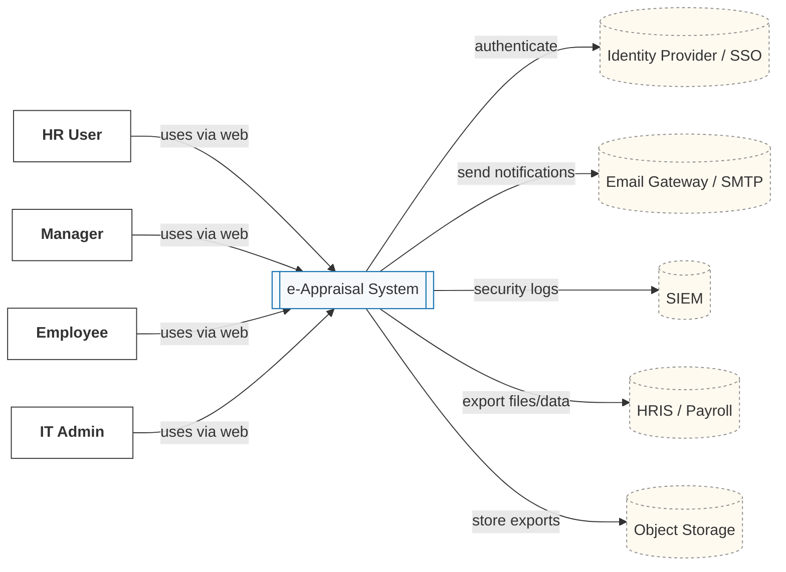
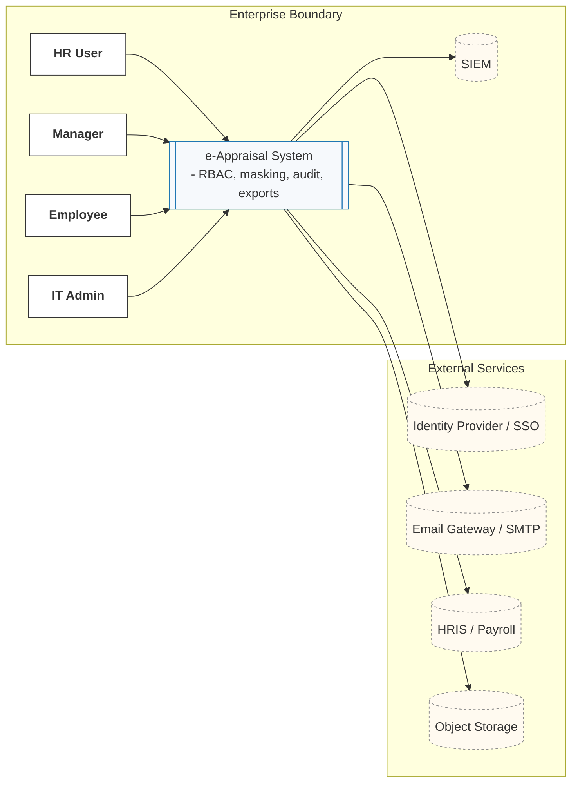

# C4 System Context - Detailed (Level 1)

e-Appraisal System  
Date: 2026-02-27

This document provides a complete C4 **System Context** view for the e-Appraisal platform. It consolidates: BRD intent, Functional and Non-Functional use-cases, confirmed clarifications, RTM, Risk Register, and Compliance Matrix. The goal is to give every stakeholder a shared understanding of the system's scope, users, external dependencies, trust boundaries, information sensitivity, and quality expectations.

---

## 1. Purpose and Goals

- Replace manual appraisal files with a single secure system for HR, Managers, and Employees.
- Enable transparent, auditable workflows: comments, feedback, CTC decisions, exports.
- Enforce security and privacy by default: masking PAN, role-based access, 3-strike lockout.
- Provide visibility and reporting for upcoming, in-process, and completed appraisals.

## 2. In Scope (Context Level)

- Role-based web access for HR, Manager, Employee, IT Admin.
- Authentication via enterprise Identity Provider (SSO).
- Email notifications for key events.
- Security monitoring via SIEM.
- Optional downstream export to HRIS/Payroll (future-friendly).

## 3. Out of Scope (Context Level)

- Multi-rater or 360-degree workflows in v1.
- Mobile native applications in v1.
- Real-time payroll updates (handled as exports, not direct writes in v1).

---

## 4. Primary Actors and Goals

- **HR**: Initiate upcoming appraisals, manage employee master, oversee status, generate reports and exports.
- **Manager**: Review personal info (read-only), enter comments, finalize promotion/CTC, set next appraisal date.
- **Employee**: Review manager comments (read-only) and submit feedback.
- **IT Admin**: Unlock accounts after lockout and manage user administration tasks.

---

## 5. External Systems and Why They Matter

- **Identity Provider (IdP/SSO)**: Centralized authentication and SSO for all user roles.
- **Email Gateway (SMTP)**: Delivery of notifications (e.g., manager comment submitted, reminders).
- **SIEM**: Central security monitoring, alerting on failed logins, unusual export volumes, etc.
- **HRIS/Payroll**: Receives appraisal outcome exports for downstream processing (phase-driven).
- **Object Storage**: Holds generated export artifacts with strict access and short-lived links (if used).

---

## 6. System Context Diagram (Mermaid)

---

## 7. Trust Boundaries and High-level Policies

- **Enterprise boundary**: Web access via HTTPS only. WAF/CDN recommended for TLS termination, rate limiting, and basic attack mitigation.
- **Identity boundary**: Authentication through IdP. Application enforces 15-minute idle timeout and role checks.
- **Data boundary**: Exports stored in object storage with server-side encryption and short-lived signed URLs. HRIS receives exports only.
- **Monitoring boundary**: All security/audit events are forwarded to SIEM. Access to audit data is controlled and logged.

---

## 8. Information Model (Context Summary)

- **Key entities**: Employee, Appraisal Case, Manager Comments, Employee Feedback, CTC Components, Export Job, Audit Event.
- **Relationships**: One Employee has zero or one active Appraisal Case. One Manager owns one or more Appraisal Cases. One Appraisal Case has many Comments and one CTC outcome.

> Detailed schemas are defined below as a context summary only (no attributes at this level).

---

## 9. Data Classification and Handling at Context Level

- **PAN and similar sensitive identifiers**: High sensitivity. Must be masked by default in UI, API responses, logs, and exports. Full PAN visible only to HR/Admin.
- **Personal information (name, contact)**: Medium sensitivity. Avoid logging; use reference IDs when possible.
- **Operational telemetry**: Low sensitivity. Must not contain PII or secrets.

---

## 10. End-to-End Quality Attributes (Targets)

- **Security**: RBAC with least privilege. 3-strike lockout. No raw PAN in logs or emails. Signed URLs for export downloads with short TTL.
- **Performance**: p95 page response time < 2 seconds under peak. Support >= 1000 concurrent users during appraisal windows.
- **Availability & Resilience**: Backups and restore tests for database and audit data. DR runbooks with defined RPO/RTO.
- **Auditability**: Append-only audit events for critical actions; retention 7 years.
- **Observability**: Central logs, dashboards for login failures, unlocks, export volumes, CTC changes.

---

## 11. User Journeys (Context Level)

- **HR initiates appraisal**: Auth via IdP -> assigns manager -> system records upcoming appraisal -> notifications as required.
- **Manager reviews and comments**: Auth -> reads employee info (read-only) -> enters comments -> saves -> audit event emitted.
- **Employee feedback**: Auth -> reads manager comments (read-only) -> submits feedback -> audit event emitted.
- **CTC finalize**: Auth -> navigates to CTC step -> edits components -> auto-calc totals -> saves -> audit event emitted.
- **IT Admin unlock**: Auth -> searches locked account -> unlock -> audit event emitted, SIEM rule monitors unlock spikes.

---

## 12. External Interactions and Constraints

- **IdP**: OIDC Authorization Code with PKCE or enterprise SAML. MFA roadmap. Session timeout enforced by app.
- **SMTP**: TLS to enterprise relay. Outbox/Retry at application level to avoid message loss.
- **SIEM**: Must ingest structured logs and audit events. Correlate repeated failed logins, export spikes, CTC edit spikes, unlock spikes.
- **HRIS**: Receives exports only (pull or push). No direct writes from HRIS into the app.
- **Object Storage**: SSE-KMS at rest, block public access, short-lived links for download.

---

## 13. Risks and Mitigations (Context Level)

- **Data leakage via exports**: Enforce role-based column policies and masking in export service; short TTL links.
- **Unauthorized access**: RBAC/ABAC, least privilege, lockout after failed attempts, SIEM alerts.
- **Comment tampering after approval**: Lock comments post-approval; append-only audit of any attempted edits.
- **CTC calculation errors**: Server-side auto-calc and validation; audit diffs on update.
- **Operational overload**: Queue long-running exports; ensure background jobs do not impact UI p95.

---

## 14. Success Metrics

- 0 production incidents related to raw PAN exposure.
- 100 percent of exports created via policy-aware service with masking.
- p95 < 2 seconds for key pages during peak windows.
- Audit search returns events for 100 percent of critical actions within seconds.

---

## 15. Open Questions to Confirm at Context Level

- IdP integration mode and MFA policy timeline.
- HRIS integration trigger (push vs pull) and file format standards for v1.
- Export retention period in object storage (separate from 7-year audit events).

---

## 16. System Context With Trust Boundaries (Mermaid)

---

## 17. RACI at Context Level (Lightweight)

- **Security and Compliance**: Own RBAC model, masking policy, SIEM rules, and retention configuration.
- **HR**: Owns appraisal process configuration, export needs, and reporting.
- **IT Admin**: Owns unlock procedures and platform access administration.
- **Engineering**: Owns implementation, testing, CI policy-as-code, and evidence maintenance.

---

## 18. References (Internal Artifacts)

- BRD, Functional and Non-Functional Use-Cases, Confirmed Clarifications, RTM, Risk Register, Compliance Matrix.

