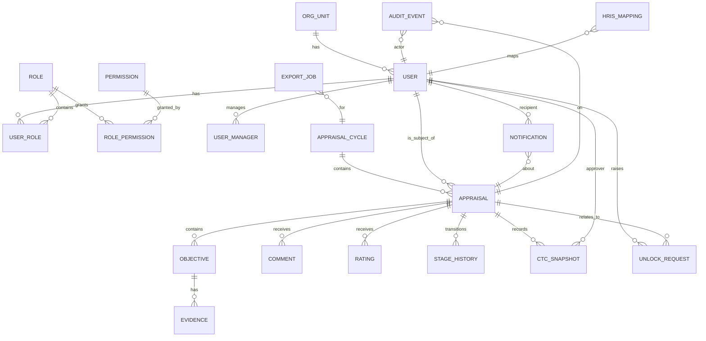

# e‑Approval / e‑Appraisal — Conceptual Data Model

**Version:** 1.0  
**Generated:** 2026-02-27 13:09

This conceptual model captures the **core business entities**, their **high‑level attributes**, and **relationships** for the e‑Approval / e‑Appraisal platform. It is **technology‑agnostic** (DB‑independent) and suitable for architecture reviews, data governance and downstream logical/physical design.

> Legend:  
> **(1)** Cardinalities appear next to each relationship.  
> **(2)** Names are singular and reflect business concepts, not tables.  
> **(3)** Personally sensitive attributes are *italicised* to emphasize masking/PII controls.

---

## 1) Conceptual ER (Mermaid)



```

---

## 2) Entities & Key Attributes (business‑level)

> **Note:** This section lists *illustrative* attributes; the logical model will normalise/denormalise as required. Fields marked with *italics* contain PII and must be masked in logs/exports.

### USER
- **userId** (business key)  
- *givenName*, *familyName*, *workEmail*, *employeeCode*  
- status (Active/Inactive), locale, timeZone  
- joinDate, exitDate  
- **orgUnitId** → ORG_UNIT  

### USER_MANAGER (self‑reference resolver)
- **userId** → USER  
- **managerId** → USER  
- effectiveFrom, effectiveTo  

### ROLE, PERMISSION, USER_ROLE, ROLE_PERMISSION
- **ROLE**: roleId, name (e.g., HR, Manager, Finance, Admin)  
- **PERMISSION**: permissionId, name, scope  
- **USER_ROLE**: **userId**, **roleId**, effectiveFrom, effectiveTo  
- **ROLE_PERMISSION**: **roleId**, **permissionId**  

### ORG_UNIT
- **orgUnitId**, name, path, costCenter  

### APPRAISAL_CYCLE
- **cycleId**, name (e.g., "2025 Mid‑Year"), startDate, endDate, state (Open/Frozen/Closed)  
- policyVersion, ratingScaleId  

### APPRAISAL (one per subject per cycle)
- **appraisalId**  
- **cycleId** → APPRAISAL_CYCLE  
- **subjectUserId** → USER  
- managerUserId → USER (current manager)  
- overallRating (derived/final), status (Draft/In‑Review/Final)  
- finalisedAt, lockedUntil  

### OBJECTIVE
- **objectiveId**, **appraisalId** → APPRAISAL  
- title, description, weight  

### EVIDENCE
- **evidenceId**, **objectiveId** → OBJECTIVE  
- fileName, storageUri (signed URL), mimeType, size, uploadedAt  

### COMMENT
- **commentId**, **appraisalId** → APPRAISAL  
- authorUserId → USER, body, visibility (Mgr/HR), createdAt  

### RATING
- **ratingId**, **appraisalId** → APPRAISAL  
- dimension (KRA/Competency), score, scale, raterUserId → USER, createdAt  

### STAGE_HISTORY
- **stageId**, **appraisalId** → APPRAISAL  
- fromStage, toStage, changedBy → USER, changedAt, reason  

### CTC_SNAPSHOT
- **ctcId**, **appraisalId** → APPRAISAL  
- approverUserId → USER, currency, componentsJson, approvedAt  

### UNLOCK_REQUEST
- **unlockId**, **appraisalId** → APPRAISAL  
- raisedBy → USER, reason, status (Pending/Approved/Rejected), processedBy → USER, processedAt  

### NOTIFICATION (Outbox)
- **notificationId**, **recipientUserId** → USER  
- topic, payloadJson, status (Queued/Sent/Failed), createdAt, sentAt, retryCount  
- aboutAppraisalId → APPRAISAL (optional)  

### EXPORT_JOB
- **exportJobId**, **cycleId** → APPRAISAL_CYCLE  
- format (CSV/XLSX/JSON), filter, createdBy → USER, createdAt, completedAt, storageUri  

### AUDIT_EVENT
- **auditId**, actorUserId → USER  
- entityType (APPRAISAL/OBJECTIVE/CTC/etc), entityId, action, at, ipHash, userAgentHash  

### HRIS_MAPPING
- **externalEmployeeId**, **userId** → USER, system (SAP/Workday/etc), active  

---

## 3) Relationship Summary (cardinalities)

- **ORG_UNIT 1 — N USER**: each user belongs to one org unit; an org has many users.  
- **USER 1 — N USER_MANAGER (as manager)**: captures changing line manager over time (SCD‑2 semantics).  
- **APPRAISAL_CYCLE 1 — N APPRAISAL**; **USER 1 — N APPRAISAL** (as subject).  
- **APPRAISAL 1 — N OBJECTIVE / COMMENT / RATING / STAGE_HISTORY / CTC_SNAPSHOT**.  
- **OBJECTIVE 1 — N EVIDENCE**.  
- **APPRAISAL 1 — N UNLOCK_REQUEST**; **USER 1 — N UNLOCK_REQUEST** (as raiser).  
- **USER 1 — N NOTIFICATION** (recipient); NOTIFICATION optionally references APPRAISAL.  
- **APPRAISAL_CYCLE 1 — N EXPORT_JOB**.  
- **USER M — N ROLE** via USER_ROLE; **ROLE M — N PERMISSION** via ROLE_PERMISSION.  

---

## 4) Business Rules (selected)

1. **One active APPRAISAL per USER per APPRAISAL_CYCLE.**  
2. **Comments freeze** when APPRAISAL moves to *Final*, unless HR approves an **UNLOCK_REQUEST**.  
3. **CTC_SNAPSHOT** is immutable once approved and is visible only to **Finance** and authorised HR roles.  
4. **Evidence & Exports** are stored via signed URLs; links expire; content is masked as per policy.  
5. All write operations emit an **AUDIT_EVENT** with actor, entity, action and timestamp.

---

## 5) Data Protection & Privacy

- Treat *PII attributes* (e.g., *givenName*, *workEmail*) as **Confidential**; mask in logs and exports.  
- Enforce **row‑level** access on APPRAISAL (subject, manager hierarchy, HR, Finance).  
- For audit retention, store **AUDIT_EVENT** in append‑only storage with 7‑year retention.  

---

## 6) Open Questions / Next Decisions

- Should **OBJECTIVE** be versioned (draft vs agreed targets)?  
- Consolidate **COMMENT** and **RATING** into a generic *feedback* structure, or keep separate?  
- Adopt canonical HR master feed for **HRIS_MAPPING** and org hierarchy cadence.

