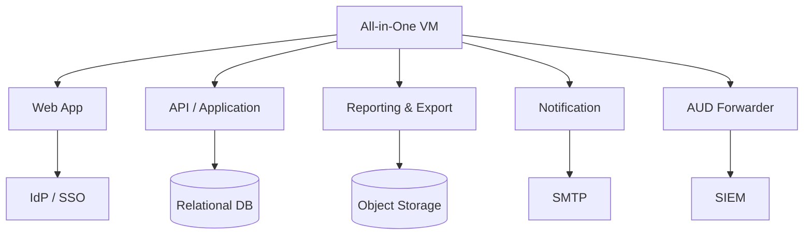
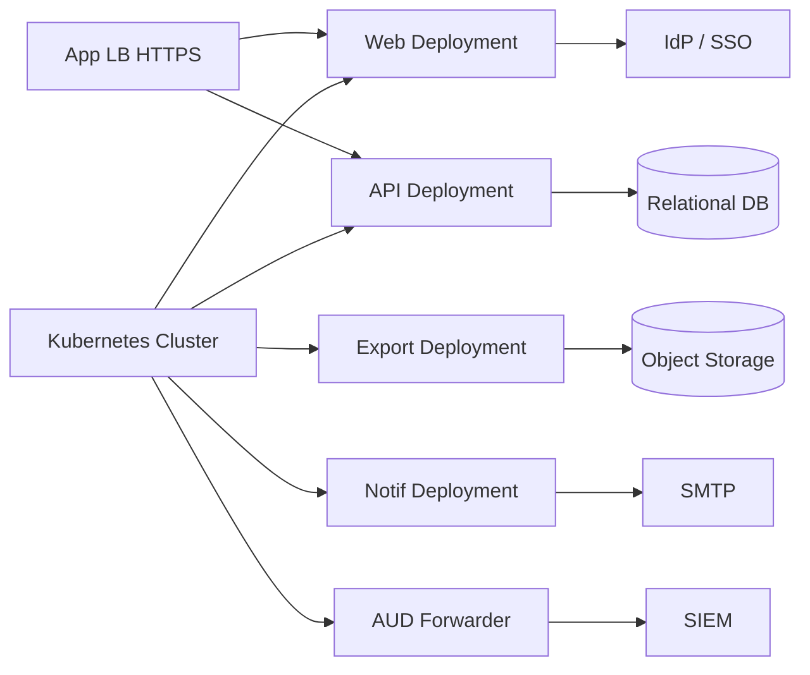
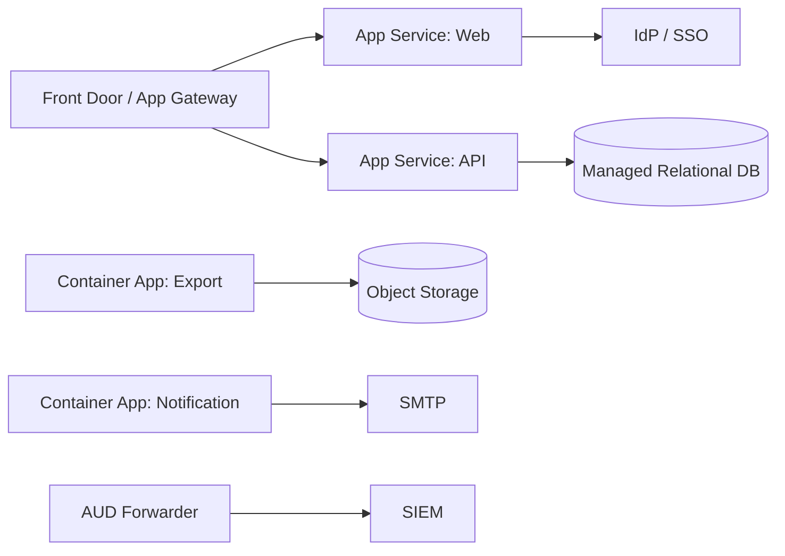

# Deployment Variants — e-Appraisal System (C4-aligned)
Date: 2026-02-27

This document presents **three deployment variants** for the e‑Appraisal platform while preserving the C4 semantics defined in L1/L2 and honoring the **FR/NFR use‑cases**, **confirmed clarifications**, and **security guardrails**:

- **Variant A — All‑in‑One VM** (single VM host)
- **Variant B — Kubernetes** (clustered containers)
- **Variant C — App Service** (managed PaaS for Web/API with managed backing services)

Each variant includes a **deployment diagram** (Mermaid + ASCII fallback) and **operational notes** mapping containers to runtime nodes, with security and NFR implications.

---

## Common C4 Containers (for reference)
- **Web App (Frontend)** — role-based UI, masking in UI, 15‑minute idle timeout
- **API / Application Service** — appraisal workflow, comments lock post‑approval, CTC step only, RBAC + field masking, audit events
- **Reporting & Export Service** — policy‑aware exports, masked columns, signed file links
- **Notification Service** — outbox -> SMTP delivery, retries, DLQ
- **Audit & Events Pipeline** — append‑only events, SIEM forwarding, 7‑year retention
- **Relational Database** — Employee/Appraisal/CTC data (encrypted, backups)
- **Object Storage** — generated exports (SSE‑KMS, signed URLs)

Key FR/NFR constraints applied in all variants:
- **Security**: PAN masking everywhere; **15‑minute idle timeout**; **3‑strike lockout**; **manual unlock by IT Admin**; least‑privilege; no raw PAN in logs/emails; SIEM alerts.
- **Audit**: Append‑only events; **7‑year retention**; export/audit references.
- **Performance**: **≥ 1000 concurrent users**, p95 < 2s; background exports must not degrade UI.
- **Ops**: Backups & quarterly restore; DR runbooks; signed URLs for exports.

---

## Variant A — All‑in‑One VM (Single Host)

**When to use:** Fastest path, simple ops for small teams; acceptable if you can still meet 1000 concurrent users (sizing required) and isolate workloads by process/service.

### A1) Deployment Diagram (All‑in‑One VM)



**ASCII Fallback**
```
 [All-in-One VM]
   |-- Web App
   |-- API / Application
   |-- Reporting & Export
   |-- Notification
   |-- AUD Forwarder
   API --> Relational DB
   Export --> Object Storage
   Notification --> SMTP
   Web --> IdP/SSO
   AUD --> SIEM
```

### A2) Mapping & Notes
- **Process isolation**: run each containerized service as a systemd service or Docker compose on the VM.
- **Perf**: ensure CPU/memory headroom; exports run with nice/ionice; consider separate export window if needed.
- **Security**: local firewall; reverse proxy TLS termination; secrets via OS vault/agent; rotate logs; **no raw PAN**; enforce idle timeout in app config.
- **Reliability**: backups (DB snapshots + file backup for logs/config); VM snapshot strategy; restore drills.
- **DR**: warm standby VM image + DB replica or regular backups; documented DNS failover.

---

## Variant B — Kubernetes (Clustered)

**When to use:** Need **scalability**, isolation, and rolling upgrades; fits NFRs for **≥ 1000 concurrent users** and spiky export loads.

### B1) Deployment Diagram (Kubernetes)



**ASCII Fallback**
```
 [App LB HTTPS] -> [Kubernetes]
   Deployments:
     - Web App
     - API
     - Reporting & Export
     - Notification
     - AUD Forwarder
   API -> Relational DB
   Export -> Object Storage
   Notification -> SMTP
   Web -> IdP/SSO
   AUD -> SIEM
```

### B2) Mapping & Notes
- **Workload separation**: Web/API/Export/Notif/AUD as separate Deployments; HPA on CPU/queue depth.
- **Security**: pod security standards; network policies; secrets in KMS/Secrets manager; TLS ingress; **masking** and **idle timeout** enforced in app.
- **Perf**: autoscale API and Export independently; ensure export jobs do not starve API; set resource requests/limits.
- **Observability**: sidecars/agents to ship structured logs; traces with correlation IDs; SIEM forwarding from AUD.
- **DR**: multi‑AZ nodes + cross‑region DB replica; object storage replication; scripted cluster bootstrapping; DNS failover.

---

## Variant C — App Service (Managed PaaS)

**When to use:** Prefer **managed** runtime, less ops toil; good fit when you want fast deployments, built‑in scaling and TLS, and managed secrets/log shipping.

### C1) Deployment Diagram (App Service)



**ASCII Fallback**
```
 [Front Door/App GW] -> App Service (Web) ; App Service (API)
   API -> Managed Relational DB
   Reporting & Export (container app) -> Object Storage
   Notification (container app) -> SMTP
   Web -> IdP/SSO
   AUD Forwarder -> SIEM
```

### C2) Mapping & Notes
- **Scaling**: per‑app autoscale rules; API and Export scale independently.
- **Security**: platform TLS; private endpoints/VNET integration; secrets via managed key vault; **no raw PAN**; **idle timeout** and **lockout** enforced in app.
- **Perf**: ensure cold‑start mitigation (minimum instances) for API/Export; background jobs isolated from web workers.
- **Ops**: managed patching for App Service; still own DB backups/restore drills and SIEM rules.
- **DR**: geo‑redundant DB; storage replication; traffic manager/front door failover.

---

## Choosing a Variant — NFR and Security Considerations

| Criterion | All-in-One VM | Kubernetes | App Service |
|---|---|---|---|
| Concurrency / p95 | Depends on VM size; careful tuning | Horizontal scaling; HPA on API/Export | Per‑app autoscale; ensure min instances |
| Export isolation | CPU contention risk; schedule windows | Separate Deployment; queue-based throttling | Run in separate app/container; throttling |
| Security hardening | OS patching + reverse proxy; firewall | PSP/NSA baseline; netpol; secrets manager | Managed TLS; VNET; key vault; platform updates |
| Audit & SIEM | Local agent/sidecar to pipeline | DaemonSet/sidecar per node/pod | Built-in log shipping + forwarder app |
| DR posture | Snapshot/standby VM + DB replica | Multi‑AZ + cross‑region; scripted rebuild | Geo‑redundant DB + front door failover |
| Ops complexity | Low to medium | Medium to high | Low |

**Always required across variants**
- **Masking** at API/Export and UI; **15‑minute idle**; **3‑strike lockout**; **IT‑admin unlock** with audit.
- **Audit retention 7 years**; structured events; SIEM rules for repeated failed logins, unlock spikes, export spikes, abnormal CTC edits.
- **Signed URLs** for export downloads; role‑based column policy; no raw PAN in logs/emails.
- **Backups + restore drills**; performance tests proving p95 < 2s at target load.

---

## CI/CD and Policy-as-Code (applies to all)
- **Fail build** if masking tests or export‑policy tests fail; check `IDLE_TIMEOUT_MINUTES=15` in config.
- **Block secrets** in repo; static checks for potential raw PAN logging.
- **Load‑test gate** before release; publish results; alert budget violations.

---

## Appendix — Container-to-Node Mapping (Summary)
- **Web App**: VM service / K8s Deployment / App Service Web
- **API / Application**: VM service / K8s Deployment / App Service API
- **Reporting & Export**: VM service / K8s Deployment / Container App (PaaS)
- **Notification**: VM service / K8s Deployment / Container App (PaaS)
- **AUD Forwarder**: VM agent or sidecar / K8s DaemonSet or sidecar / Forwarder App
- **Relational DB**: Local or managed instance with TDE, PITR, replicas
- **Object Storage**: Managed storage with SSE‑KMS, signed URLs

