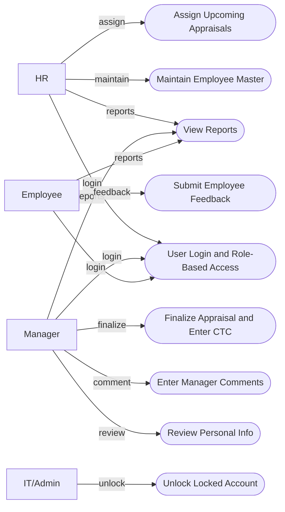
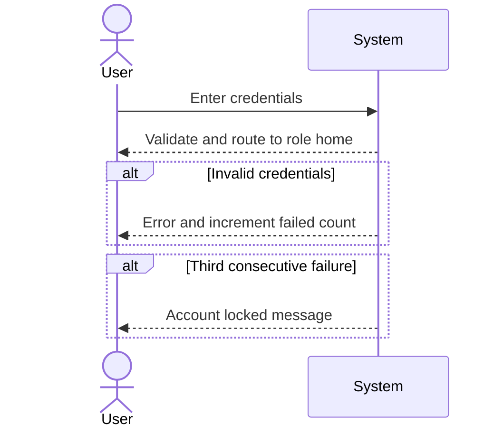
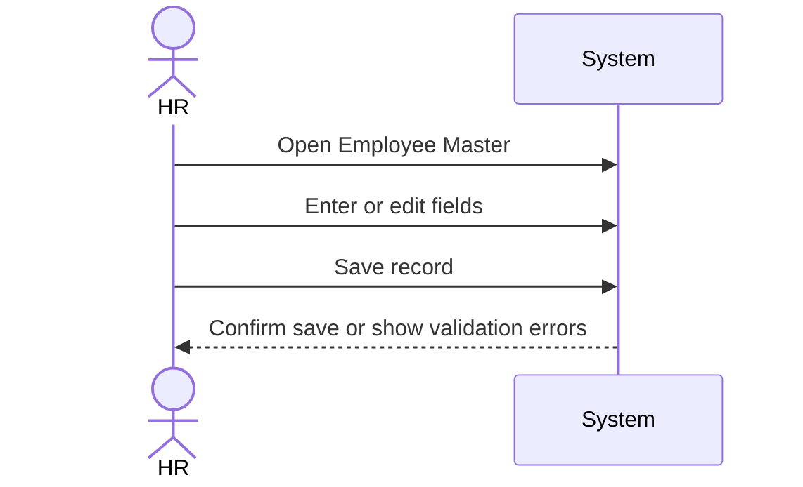
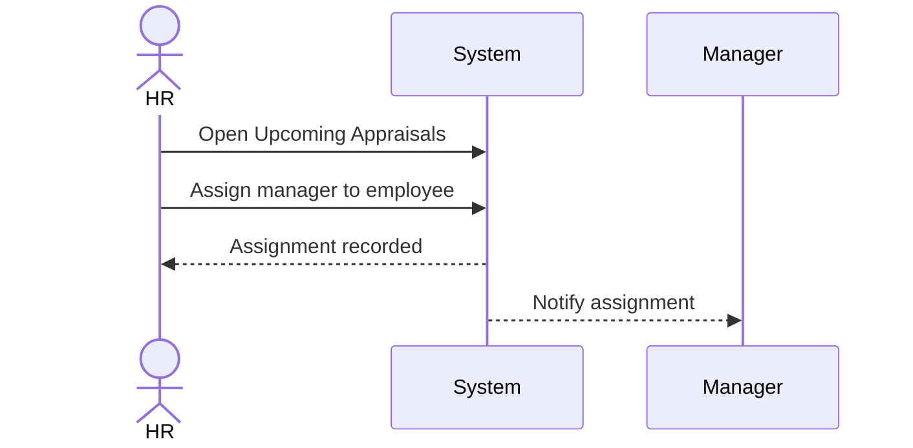
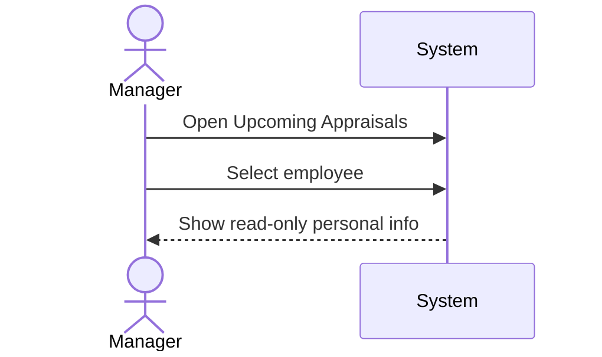
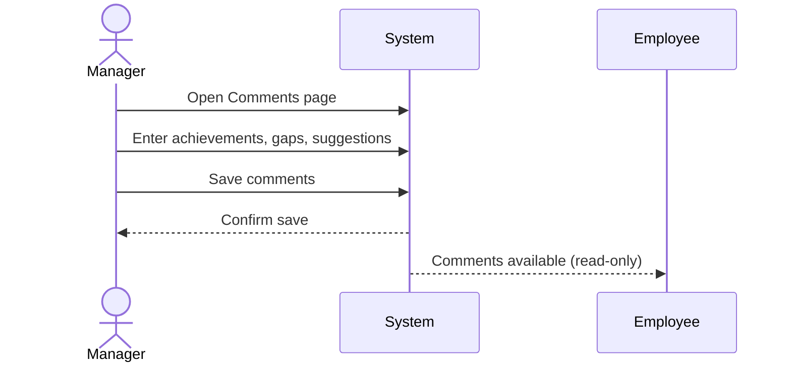
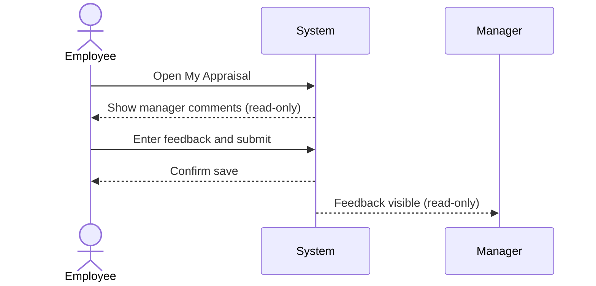
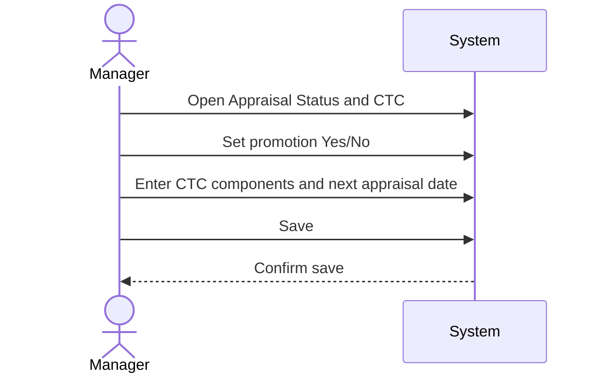
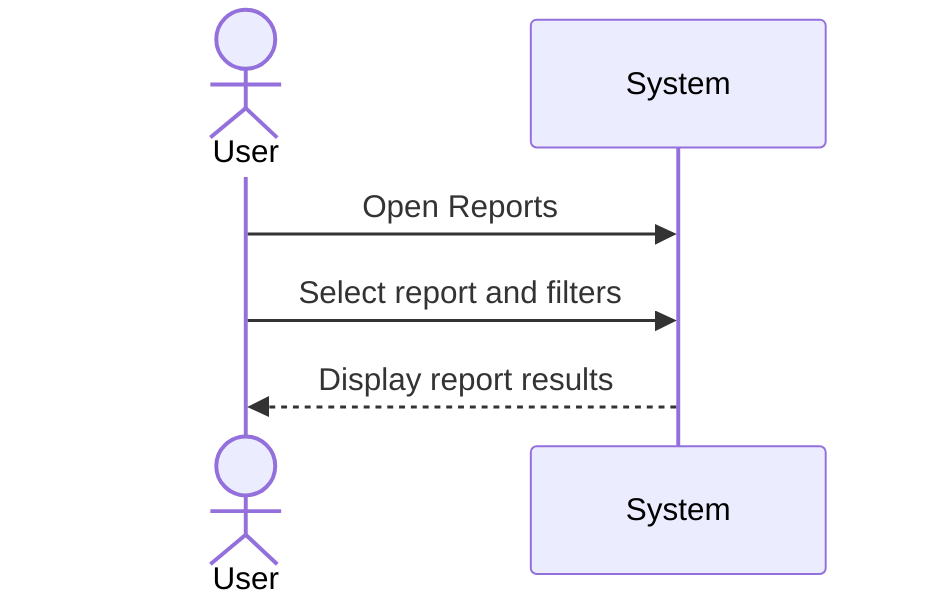
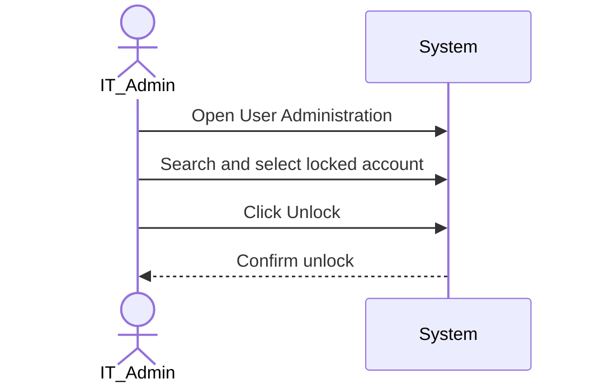

# e-Appraisal System: Use Cases and Diagrams

_Generated on: 2026-02-27_

## Table of Contents
- [1. Use-Case Model Overview](#1-use-case-model-overview)
- [2. Use-Case Diagram](#2-use-case-diagram)
- [3. Use-Case Specifications](#3-use-case-specifications)
  - [UC-01 User Login and Role-Based Access](#uc-01-user-login-and-role-based-access)
  - [UC-02 HR Maintain Employee Master](#uc-02-hr-maintain-employee-master)
  - [UC-03 HR Assign Upcoming Appraisals](#uc-03-hr-assign-upcoming-appraisals)
  - [UC-04 Manager Review Personal Info](#uc-04-manager-review-personal-info)
  - [UC-05 Manager Enter Comments](#uc-05-manager-enter-comments)
  - [UC-06 Employee Submit Feedback](#uc-06-employee-submit-feedback)
  - [UC-07 Manager Finalize Appraisal and Enter CTC](#uc-07-manager-finalize-appraisal-and-enter-ctc)
  - [UC-08 View Reports](#uc-08-view-reports)
  - [UC-09 Unlock Locked Account](#uc-09-unlock-locked-account)
- [4. Sequence Diagrams](#4-sequence-diagrams)

## 1. Use-Case Model Overview
Actors: HR, Manager (Appraiser), Employee (Appraisee), IT/Admin (for account unlock).
System Goal: Digitize appraisals, provide visibility, and secure data with role-based access and account lockout.

## 2. Use-Case Diagram
The diagram uses a simple Mermaid "graph LR" with basic node shapes to maximize GitHub compatibility.

## 3. Use-Case Specifications

### UC-01 User Login and Role-Based Access
**Primary Actor:** Any user (HR, Manager, Employee)

**Goal:** Authenticate user and present role-appropriate home and navigation.

**Preconditions:** User account exists.

**Postconditions:** User is logged in, or account is locked after 3 consecutive invalid attempts.

**Main Flow:**
1. User enters username and password.
2. System validates credentials.
3. System routes user to role-based home (HR, Manager, Employee).

**Alternate/Exception Flows:**
A1. Invalid credentials: System increments failed attempt count and shows error.
A2. Three consecutive failures: System locks the account and displays lock message.

### UC-02 HR Maintain Employee Master
**Primary Actor:** HR

**Goal:** Create or update employee master data.

**Preconditions:** HR is authenticated.

**Postconditions:** Employee record is created or updated.

**Main Flow:**
1. HR navigates to Employee Master.
2. HR enters or edits fields: Name, Address, City, Phone, Mobile, Email, DOB, Gender, Marital Status, DOJ, Passport, PAN, Work Experience, Reports To, Department.
3. HR saves the record.

**Alternate/Exception Flows:**
A1. Validation errors: System highlights invalid or missing fields and requests correction.

### UC-03 HR Assign Upcoming Appraisals
**Primary Actor:** HR

**Goal:** Assign employees with due appraisals to their managers to initiate workflow.

**Preconditions:** Employee master exists; appraisal due date calculated or provided.

**Postconditions:** Appraisal case is created/updated with assigned manager and status set to In Progress.

**Main Flow:**
1. HR opens Upcoming Appraisals.
2. HR selects an employee and assigns a manager.
3. System notifies/queues the assignment for the manager.

**Alternate/Exception Flows:**
A1. Missing manager mapping: System blocks assignment and asks HR to update Reports To.

### UC-04 Manager Review Personal Info
**Primary Actor:** Manager

**Goal:** Review read-only personal and employment information of the appraisee.

**Preconditions:** Appraisal case is assigned to the manager.

**Postconditions:** Manager proceeds to enter comments.

**Main Flow:**
1. Manager opens Upcoming Appraisals and selects an employee.
2. System shows read-only personal information.
3. Manager navigates to the comments page.

### UC-05 Manager Enter Comments
**Primary Actor:** Manager

**Goal:** Record achievements, gaps, and suggestions for the employee.

**Preconditions:** Manager reviewed employee information.

**Postconditions:** Manager comments are saved; employee can later provide feedback.

**Main Flow:**
1. Manager enters Achievements, Things Not Achieved, and Suggestions.
2. Manager saves comments.
3. System stores comments and makes them visible (read-only) to the employee.

**Alternate/Exception Flows:**
A1. Save-only path: If manager is not ready to proceed, comments are saved and the flow ends for now.

### UC-06 Employee Submit Feedback
**Primary Actor:** Employee

**Goal:** Submit feedback after manager has entered comments.

**Preconditions:** Manager comments exist; employee is authenticated.

**Postconditions:** Employee feedback is saved and visible to the manager (read-only).

**Main Flow:**
1. Employee opens My Appraisal.
2. Employee reviews Manager Comments (read-only).
3. Employee enters feedback and submits.

**Alternate/Exception Flows:**
A1. Comments not yet available: System informs the employee to wait until manager comments are entered.

### UC-07 Manager Finalize Appraisal and Enter CTC
**Primary Actor:** Manager

**Goal:** Record promotion decision and update CTC components; set next appraisal date.

**Preconditions:** Manager comments and employee feedback are present (if provided).

**Postconditions:** Appraisal is finalized with decision and CTC details saved.

**Main Flow:**
1. Manager opens Appraisal Status and CTC page.
2. Manager selects Promotion Yes/No.
3. Manager enters CTC components: Basic, DA, HRA, Food Allowance, PF.
4. Manager sets Next Appraisal Date and saves.

**Alternate/Exception Flows:**
A1. Missing mandatory CTC fields: System flags fields and prevents save.

### UC-08 View Reports
**Primary Actor:** HR, Manager, Employee (role-limited views)

**Goal:** View standard reports such as Upcoming Appraisals, In-Process, and Completed with outcomes.

**Preconditions:** Relevant data exists; user is authenticated.

**Postconditions:** User views report results filtered by role and permissions.

**Main Flow:**
1. User navigates to Reports.
2. User selects report type and filter criteria.
3. System displays results.

### UC-09 Unlock Locked Account
**Primary Actor:** IT/Admin

**Goal:** Manually unlock user accounts locked after failed login attempts.

**Preconditions:** Account is locked due to failed attempts.

**Postconditions:** Account is unlocked; user can log in again.

**Main Flow:**
1. IT/Admin opens User Administration.
2. IT/Admin searches and selects the locked account.
3. IT/Admin clicks Unlock; system confirms unlock.

## 4. Sequence Diagrams
All sequence diagrams use neutral labels to ensure they render cleanly on GitHub.

### UC-01 User Login and Role-Based Access

### UC-02 HR Maintain Employee Master

### UC-03 HR Assign Upcoming Appraisals

### UC-04 Manager Review Personal Info

### UC-05 Manager Enter Comments

### UC-06 Employee Submit Feedback

### UC-07 Manager Finalize Appraisal and Enter CTC

### UC-08 View Reports

### UC-09 Unlock Locked Account

