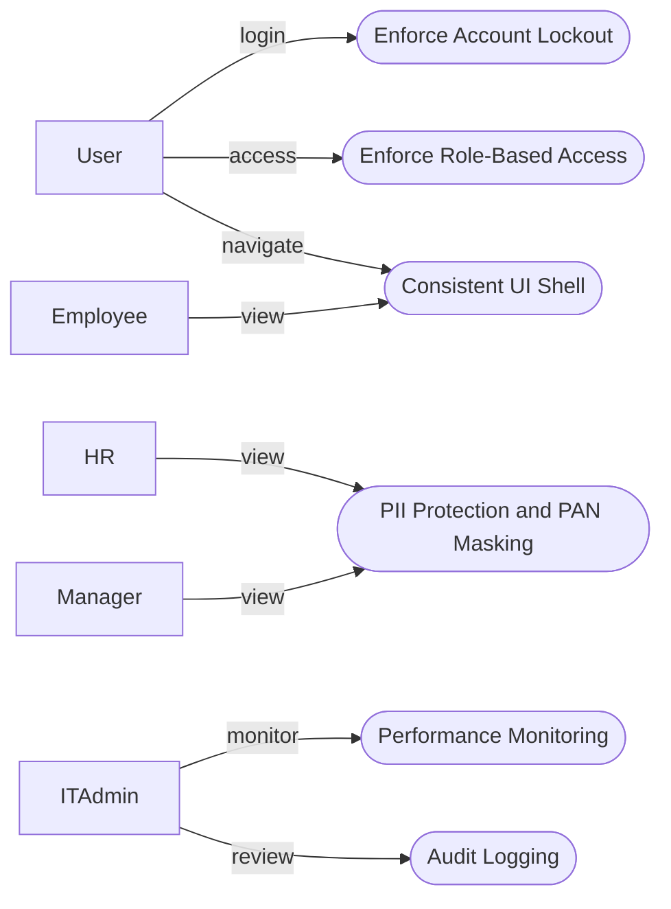
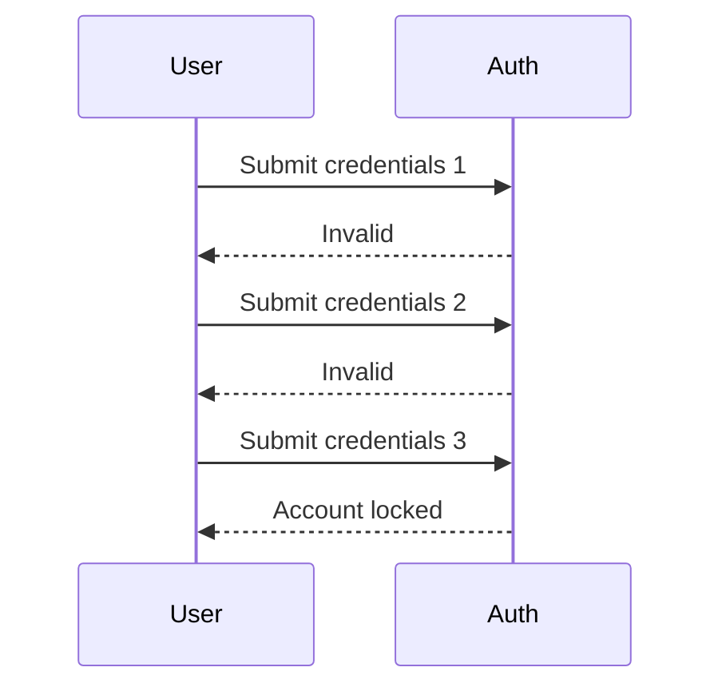
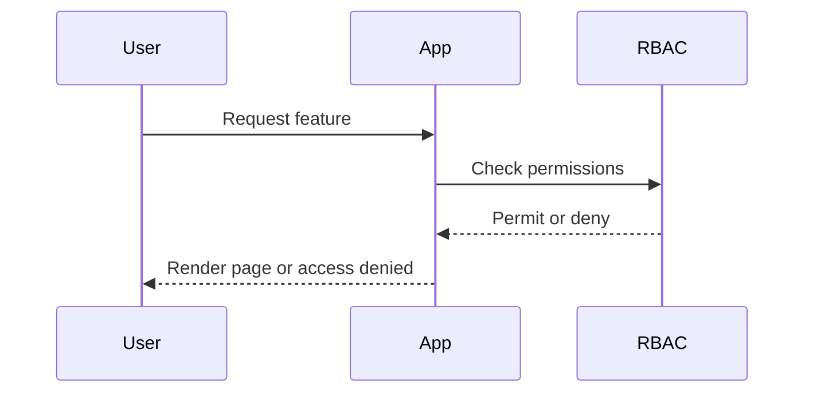
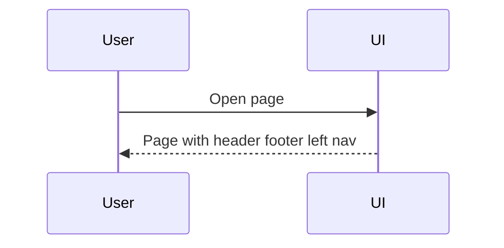
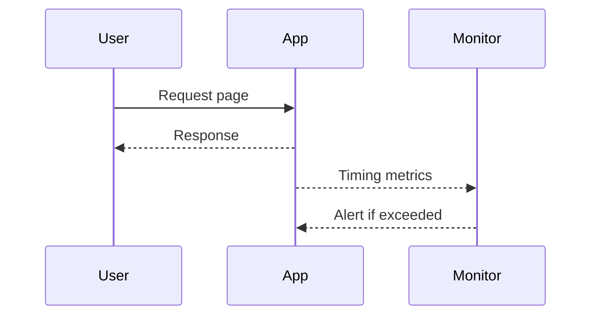
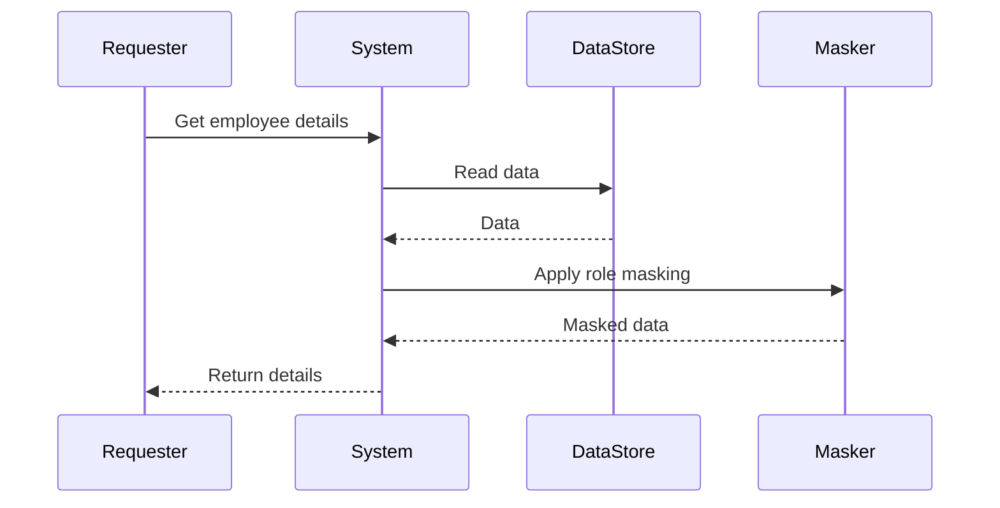
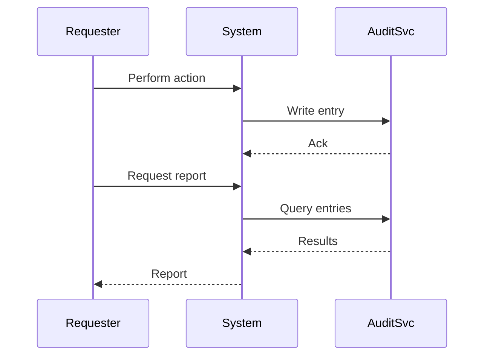

# e-Appraisal System: NFR Use Cases and Diagrams (Final Fix v2)

_Updated on: 2026-02-27_

## Table of Contents
- [1. Scope and Source](#1-scope-and-source)
- [2. NFR Use-Case Diagram](#2-nfr-use-case-diagram)
- [3. NFR Use-Case Specifications](#3-nfr-use-case-specifications)
  - [NFR-UC-01 Enforce Account Lockout](#nfr-uc-01-enforce-account-lockout)
  - [NFR-UC-02 Enforce Role-Based Access](#nfr-uc-02-enforce-role-based-access)
  - [NFR-UC-03 Enforce Consistent UI Shell](#nfr-uc-03-enforce-consistent-ui-shell)
  - [NFR-UC-04 Monitor Performance Thresholds](#nfr-uc-04-monitor-performance-thresholds)
  - [NFR-UC-05 Protect PII and Mask PAN](#nfr-uc-05-protect-pii-and-mask-pan)
  - [NFR-UC-06 Maintain Audit Logs](#nfr-uc-06-maintain-audit-logs)
- [4. Sequence Diagrams](#4-sequence-diagrams)

## 1. Scope and Source
This document extracts Non-Functional Requirements (NFR) from the BRD and expresses them as testable use cases with diagrams. All labels are ASCII-only for clean rendering on GitHub.

## 2. NFR Use-Case Diagram

## 3. NFR Use-Case Specifications
### NFR-UC-01 Enforce Account Lockout
**Primary Actor:** User

**Goal:** Lock account after 3 consecutive invalid login attempts.

**Preconditions:** User account exists; login service available.

**Postconditions:** Account remains active on valid login, or is locked after 3 failures and requires manual unlock.

**Main Flow:**
1. User submits credentials.
2. System validates credentials and tracks failures.
3. On success, user is signed in.

**Alternate/Exception Flows:**
A1. Failure count reaches 3: System locks account and shows lock message.

### NFR-UC-02 Enforce Role-Based Access
**Primary Actor:** User

**Goal:** Ensure users see only features permitted by their roles.

**Preconditions:** User is authenticated and has one or more roles.

**Postconditions:** Access granted to allowed resources; access denied to restricted resources.

**Main Flow:**
1. User requests a protected feature.
2. System evaluates role permissions.
3. System renders allowed navigation and blocks unauthorized actions.

**Alternate/Exception Flows:**
A1. Unauthorized request: System shows access denied message and logs the attempt.

### NFR-UC-03 Enforce Consistent UI Shell
**Primary Actor:** User

**Goal:** Provide the same header, footer, and left navigation on each page with minimal clicks to navigate.

**Preconditions:** Application UI shell is available.

**Postconditions:** Every page includes the standard shell; navigation depth is minimized.

**Main Flow:**
1. User opens any page.
2. System composes page content within the standard shell.
3. User navigates using consistent controls.

**Alternate/Exception Flows:**
A1. Shell resource missing: System falls back to default shell and logs the event.

### NFR-UC-04 Monitor Performance Thresholds
**Primary Actor:** IT/Admin

**Goal:** Monitor page response times and alert if thresholds are exceeded.

**Preconditions:** Monitoring agent is active; thresholds configured.

**Postconditions:** Metrics recorded; alerts generated if threshold breaches occur.

**Main Flow:**
1. User requests a page.
2. System serves the page and emits timing metrics.
3. Monitor records metrics and evaluates thresholds.

**Alternate/Exception Flows:**
A1. Threshold exceeded: Monitor sends alert to Admin.

### NFR-UC-05 Protect PII and Mask PAN
**Primary Actor:** HR, Manager, Employee

**Goal:** Protect personal data and mask PAN on screens for non-privileged users.

**Preconditions:** Data access request initiated; masking rules configured.

**Postconditions:** PAN is masked for non-privileged roles; stored data is protected.

**Main Flow:**
1. Actor requests employee details.
2. System retrieves data from store.
3. System applies masking based on role and serves the response.

**Alternate/Exception Flows:**
A1. Privileged role (HR/Admin): System shows full PAN as permitted by policy.

### NFR-UC-06 Maintain Audit Logs
**Primary Actor:** IT/Admin

**Goal:** Maintain audit records for create, update, and decision events and enable review.

**Preconditions:** Audit service available.

**Postconditions:** Audit entries stored and retrievable for reporting.

**Main Flow:**
1. Actor performs an action that changes system state.
2. System writes an audit entry with who, what, when.
3. Admin reviews audit logs when required.

**Alternate/Exception Flows:**
A1. Audit write failure: System retries and raises an alert if persistent.

## 4. Sequence Diagrams
All diagrams declare participants first and use simple messages only. For maximum GitHub compatibility, participant names use letters only (no slashes or spaces).

### NFR-UC-01 Enforce Account Lockout

### NFR-UC-02 Enforce Role-Based Access

### NFR-UC-03 Enforce Consistent UI Shell

### NFR-UC-04 Monitor Performance Thresholds

### NFR-UC-05 Protect PII and Mask PAN

### NFR-UC-06 Maintain Audit Logs

