# eAppraisal System - Architecture Diagram

## Layered Architecture Overview

```mermaid
graph TB
    %% =============================================
    %% CLIENTS / USERS
    %% =============================================
    subgraph USERS["USERS (Browser)"]
        direction LR
        Admin["Admin"]
        HR["HR"]
        Manager["Manager"]
        Employee["Employee"]
    end

    %% =============================================
    %% PRESENTATION LAYER
    %% =============================================
    subgraph PRESENTATION["PRESENTATION LAYER (eAppraisal.Web - Port 5200)"]
        direction TB
        subgraph WebControllers["MVC Controllers"]
            AccountCtrl["AccountController\n- Login / Logout"]
            AdminCtrl["AdminController\n- Users / CreateUser\n- Lock / Unlock"]
            HRCtrl["HRController\n- Employees / Cycles\n- Assign Appraisals"]
            ManagerCtrl["ManagerController\n- MyAppraisals / Comments\n- Finalize"]
            EmployeeCtrl["EmployeeController\n- MyProfile / EditProfile\n- MyAppraisal / Feedback"]
            ReportsCtrl["ReportsController\n- Upcoming / InProcess\n- Completed"]
        end
        subgraph WebViews["Razor Views"]
            Views["Admin Views | HR Views\nManager Views | Employee Views\nShared Layout + Sidebar"]
        end
        subgraph WebInfra["Web Infrastructure"]
            ApiClient["ApiClient\n(HTTP Client + Cookie Forwarding)"]
            Session["Session Store\n(Auth Cookie Management)"]
        end
    end

    %% =============================================
    %% API & ORCHESTRATION LAYER
    %% =============================================
    subgraph API["API & ORCHESTRATION LAYER (eAppraisal.Api - Port 5100)"]
        direction TB
        subgraph ApiControllers["REST API Controllers"]
            AuthAPI["AuthController\n- POST login (AllowAnonymous)\n- POST register (Authorize)\n- POST logout\n- GET me"]
            AdminAPI["AdminController\n- GET users\n- POST lock / unlock"]
            EmployeesAPI["EmployeesController\n- GET all / GET by-id\n- POST create / PUT update\n- PUT profile"]
            CyclesAPI["CyclesController\n- GET all / GET open\n- POST create / PUT update\n- POST unassigned-employees"]
            AppraisalsAPI["AppraisalsController\n- GET by-manager / by-employee\n- GET by-status / detail\n- POST assign / comment\n- POST feedback / finalize"]
        end
        subgraph Middleware["Middleware Pipeline"]
            AuthMiddleware["Authentication\n(Cookie-based)"]
            AuthzMiddleware["Authorization\n(Role-based)"]
        end
    end

    %% =============================================
    %% DOMAIN SERVICES LAYER
    %% =============================================
    subgraph DOMAIN_SERVICES["DOMAIN SERVICES LAYER (eAppraisal.Application)"]
        direction TB
        subgraph CoreServices["Core Business Services"]
            AuthSvc["AuthService\n- Login / Logout\n- RegisterUser\n- Lock / Unlock"]
            EmpSvc["EmployeeService\n- CRUD Operations\n- Profile Updates"]
            CycleSvc["CycleService\n- CRUD Operations\n- Open Cycles\n- Unassigned Employees"]
        end
        subgraph AppraisalServices["Appraisal Domain Services"]
            WorkflowSvc["AppraisalWorkflowService\n- Assign Appraisal\n- Finalize Appraisal"]
            CommentsSvc["CommentsService\n- Save Manager Comments\n- Save Employee Feedback\n- Lock Comments"]
            CtcSvc["CtcService\n- Create/Update\n  CTC Snapshot"]
            ReportingSvc["ReportingService\n- By Manager / By Employee\n- By Status / Detail View"]
        end
        subgraph PolicyServices["Policy & Rules Services"]
            EligibilitySvc["EligibilityRulesService\n- Validate Assignment\n- Validate Comment\n- Validate Feedback\n- Validate Finalization"]
            MaskingEngine["PolicyMaskingEngine\n- PAN Masking by Role\n- HR/Admin: Full View\n- Others: Masked"]
        end
    end

    %% =============================================
    %% PLATFORM & CROSS-CUTTING LAYER
    %% =============================================
    subgraph CROSSCUTTING["PLATFORM & CROSS-CUTTING LAYER (eAppraisal.Infrastructure)"]
        direction TB
        subgraph AuditNotify["Audit & Notification"]
            AuditSvc["AuditLogCollector\n- Log all entity changes\n- Track actor + IP + timestamp"]
            NotifSvc["NotificationService\n- Queue notifications\n- Appraisal events"]
        end
        subgraph Config["Configuration & Observability"]
            ConfigSvc["ConfigurationService\n- App Settings\n- Connection Strings"]
            ObsSvc["ObservabilityAgent\n- Structured Logging\n- Event Tracking"]
        end
        subgraph Security["Security & Resilience"]
            RateLimiter["InMemoryRateLimiter\n- Sliding Window\n- Per-Key Throttling"]
            FeatureFlags["InMemoryFeatureFlagService\n- Config-based Flags\n- Feature Toggles"]
        end
    end

    %% =============================================
    %% EXTERNAL SERVICES
    %% =============================================
    subgraph EXTERNAL["EXTERNAL SERVICES / INTEGRATIONS"]
        direction TB
        IdentitySvc["IdentityUserStore\n(ASP.NET Core Identity)\n- Authentication\n- User Management\n- Password Hashing"]
        SmtpGateway["LocalSmtpGateway\n(SMTP Stub)\n- Email Logging\n- Swappable for SendGrid"]
        HrisSvc["StubHrisPayrollService\n(HRIS/Payroll Stub)\n- Mock Payroll Data\n- Employee Sync"]
    end

    %% =============================================
    %% DATA LAYER
    %% =============================================
    subgraph DATA["DATA LAYER"]
        direction TB
        subgraph EFCore["Entity Framework Core 8"]
            DbContext["AppDbContext\n(IAppDbContext)"]
        end
        subgraph Database["SQLite Database"]
            DB[("eappraisal.db\n-----------\nEmployees\nAppraisalCycles\nAppraisals\nComments\nEmployeeFeedbacks\nCtcSnapshots\nStageHistories\nAuditEvents\nNotifications\nAspNetUsers\nAspNetRoles")]
        end
    end

    %% =============================================
    %% SHARED / DOMAIN LAYER
    %% =============================================
    subgraph SHARED["SHARED DOMAIN LAYER (eAppraisal.Domain)"]
        direction LR
        Entities["Entities\n- Employee\n- Appraisal\n- AppraisalCycle\n- Comment\n- EmployeeFeedback\n- CtcSnapshot\n- StageHistory\n- AuditEvent\n- Notification"]
        DTOs["DTOs\n- LoginDto / AuthResultDto\n- EmployeeDto / UserDto\n- CycleDto / AppraisalDto\n- AppraisalDetailDto\n- ManagerCommentDto\n- EmployeeFeedbackDto\n- FinalizeAppraisalDto"]
        Interfaces["Interfaces\n(18 Service Contracts)"]
    end

    %% =============================================
    %% CONNECTIONS
    %% =============================================

    %% Users to Presentation
    Admin -->|"HTTPS :5200"| AdminCtrl
    HR -->|"HTTPS :5200"| HRCtrl
    Manager -->|"HTTPS :5200"| ManagerCtrl
    Employee -->|"HTTPS :5200"| EmployeeCtrl
    USERS -->|"Login"| AccountCtrl
    USERS -->|"Reports"| ReportsCtrl

    %% Presentation to API
    WebControllers -->|"Uses"| ApiClient
    ApiClient -->|"HTTP :5100\n(JSON + Cookie)"| ApiControllers

    %% API to Domain Services
    AuthAPI --> AuthSvc
    AdminAPI --> AuthSvc
    EmployeesAPI --> EmpSvc
    EmployeesAPI --> MaskingEngine
    CyclesAPI --> CycleSvc
    AppraisalsAPI --> WorkflowSvc
    AppraisalsAPI --> CommentsSvc
    AppraisalsAPI --> ReportingSvc

    %% Domain Services internal dependencies
    WorkflowSvc --> CtcSvc
    WorkflowSvc --> CommentsSvc
    WorkflowSvc --> AuditSvc
    WorkflowSvc --> NotifSvc
    CommentsSvc --> AuditSvc
    AuthSvc --> IdentitySvc
    AuthSvc --> AuditSvc

    %% Cross-cutting used by all
    DOMAIN_SERVICES -.->|"Logging"| ObsSvc
    DOMAIN_SERVICES -.->|"Config"| ConfigSvc

    %% Infrastructure to Data
    DbContext --> DB
    AuditSvc --> DbContext
    NotifSvc --> DbContext
    DOMAIN_SERVICES --> DbContext
    IdentitySvc --> DbContext

    %% Shared layer references
    DOMAIN_SERVICES -.->|"Uses"| SHARED
    API -.->|"Uses"| SHARED

    %% Styling
    classDef userStyle fill:#4A90D9,stroke:#2C5F8A,color:#FFFFFF,stroke-width:2px
    classDef presStyle fill:#68C5A5,stroke:#3D8B6B,color:#000000,stroke-width:2px
    classDef apiStyle fill:#F5A623,stroke:#C47D12,color:#000000,stroke-width:2px
    classDef domainStyle fill:#9B59B6,stroke:#6C3483,color:#FFFFFF,stroke-width:2px
    classDef crossStyle fill:#E67E22,stroke:#A35C14,color:#FFFFFF,stroke-width:2px
    classDef extStyle fill:#95A5A6,stroke:#617172,color:#000000,stroke-width:2px
    classDef dataStyle fill:#3498DB,stroke:#2171A9,color:#FFFFFF,stroke-width:2px
    classDef sharedStyle fill:#F39C12,stroke:#B87509,color:#000000,stroke-width:2px

    class Admin,HR,Manager,Employee userStyle
    class AccountCtrl,AdminCtrl,HRCtrl,ManagerCtrl,EmployeeCtrl,ReportsCtrl,ApiClient,Session,Views presStyle
    class AuthAPI,AdminAPI,EmployeesAPI,CyclesAPI,AppraisalsAPI,AuthMiddleware,AuthzMiddleware apiStyle
    class AuthSvc,EmpSvc,CycleSvc,WorkflowSvc,CommentsSvc,CtcSvc,ReportingSvc,EligibilitySvc,MaskingEngine domainStyle
    class AuditSvc,NotifSvc,ConfigSvc,ObsSvc,RateLimiter,FeatureFlags crossStyle
    class IdentitySvc,SmtpGateway,HrisSvc extStyle
    class DbContext,DB dataStyle
    class Entities,DTOs,Interfaces sharedStyle
```



## Component Summary

| Layer | Project | Port | Components |
|-------|---------|------|------------|
| **Presentation** | eAppraisal.Web | 5200 | 6 MVC Controllers, Razor Views, ApiClient |
| **API & Orchestration** | eAppraisal.Api | 5100 | 5 REST Controllers, Cookie Auth Middleware |
| **Domain Services** | eAppraisal.Application | - | 9 Business Services (3 Core + 4 Appraisal + 2 Policy) |
| **Cross-Cutting** | eAppraisal.Infrastructure | - | 6 Platform Services (Audit, Notification, Config, Logging, Rate Limiting, Feature Flags) |
| **External Services** | eAppraisal.Infrastructure | - | 3 Integration Points (Identity, SMTP, HRIS) |
| **Data** | eAppraisal.Infrastructure | - | EF Core 8 + SQLite (11 Tables) |
| **Shared Domain** | eAppraisal.Domain | - | 9 Entities, 7 DTOs, 18 Interfaces |

## Data Flow

```
Browser (User)
    --> eAppraisal.Web (MVC + Razor, Port 5200)
        --> ApiClient (HTTP + Cookie Forwarding)
            --> eAppraisal.Api (REST, Port 5100)
                --> Domain Services (Business Logic)
                    --> Cross-Cutting (Audit, Notifications, Logging)
                    --> External Services (Identity, SMTP, HRIS)
                    --> EF Core --> SQLite Database
```
