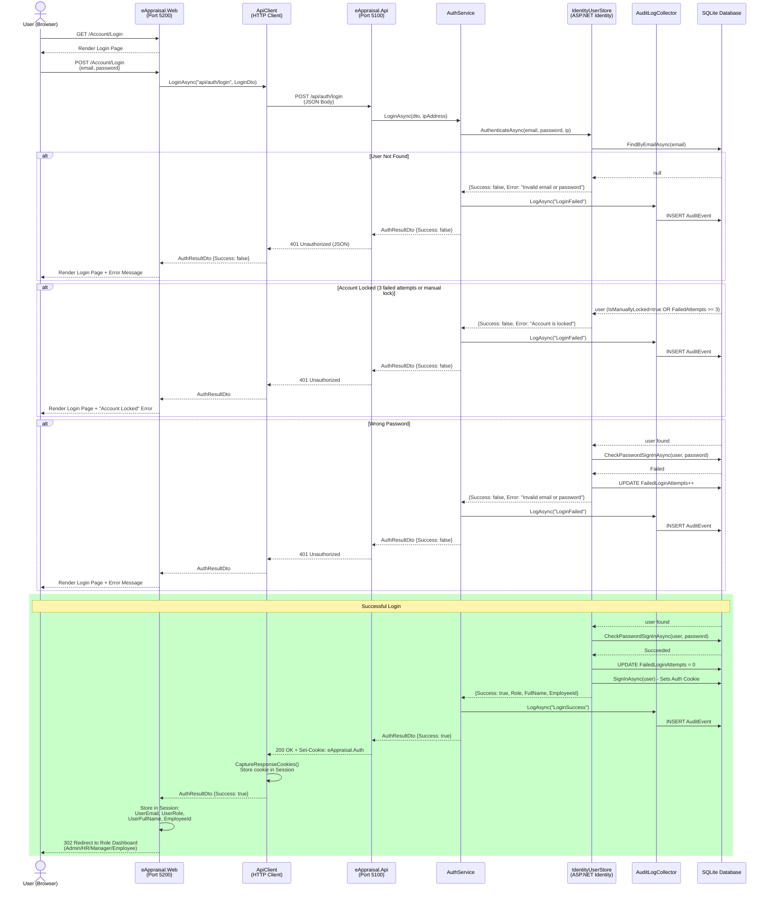
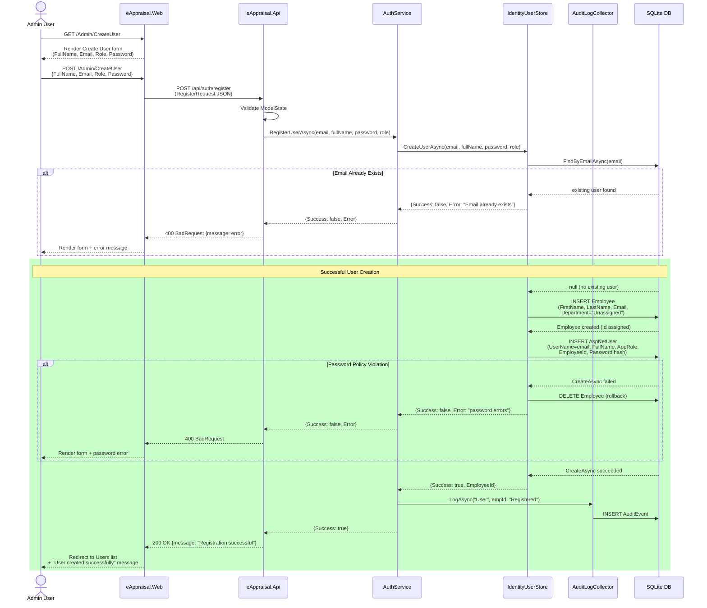
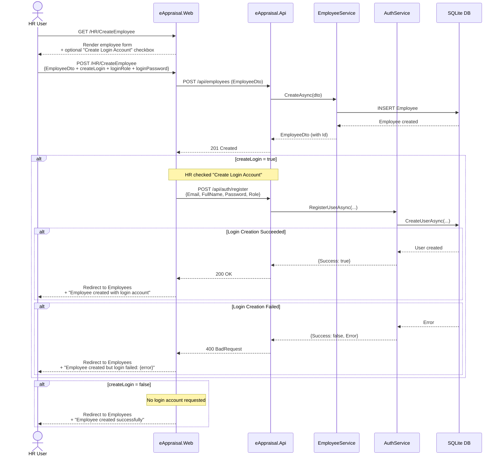
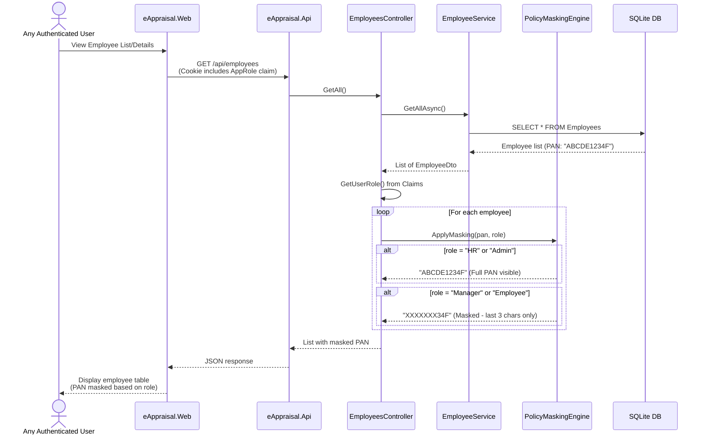
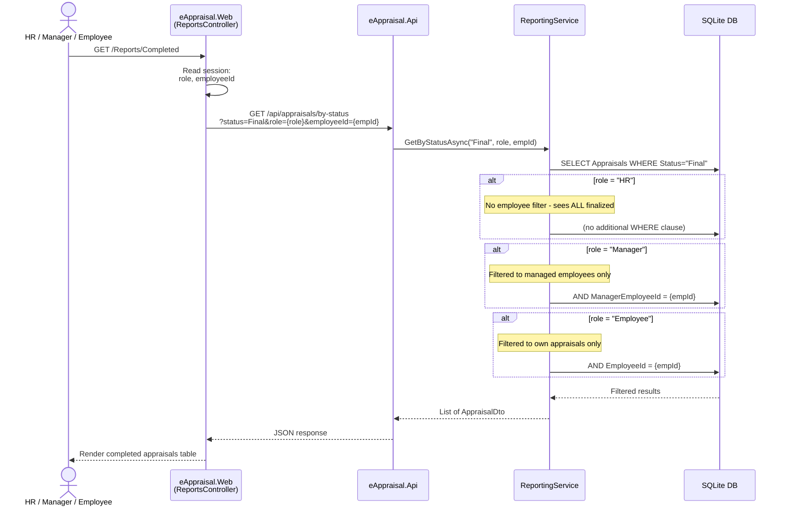

# eAppraisal System - Sequence Diagrams

---

## 1. User Login Flow

---

## 2. Full Appraisal Workflow (Assign --> Comment --> Feedback --> Finalize)

```mermaid
sequenceDiagram
    actor HR as HR User
    actor Mgr as Manager
    actor Emp as Employee
    participant Web as eAppraisal.Web
    participant API as eAppraisal.Api
    participant WorkflowSvc as AppraisalWorkflow<br/>Service
    participant CommentsSvc as Comments<br/>Service
    participant CtcSvc as CtcService
    participant ReportingSvc as Reporting<br/>Service
    participant AuditSvc as AuditLog<br/>Collector
    participant NotifSvc as Notification<br/>Service
    participant DB as SQLite DB

    %% =============================================
    %% PHASE 1: HR ASSIGNS APPRAISAL
    %% =============================================
    rect rgb(230, 240, 255)
        Note over HR,DB: PHASE 1 - HR Assigns Appraisal (Status: None --> Draft)

        HR->>Web: GET /HR/UpcomingAppraisals
        Web->>API: GET /api/cycles/open
        API-->>Web: Open Cycles
        Web->>API: POST /api/cycles/unassigned-employees
        API-->>Web: Employees without appraisals
        Web-->>HR: Show unassigned employees list

        HR->>Web: POST /HR/AssignAppraisal<br/>{EmployeeId, CycleId}
        Web->>API: POST /api/appraisals/assign
        API->>WorkflowSvc: AssignAsync(empId, cycleId, assignedBy)

        WorkflowSvc->>DB: Find Employee (verify has Manager)
        DB-->>WorkflowSvc: Employee record
        WorkflowSvc->>DB: INSERT Appraisal (Status="Draft")
        WorkflowSvc->>DB: INSERT StageHistory<br/>(None --> Draft)
        WorkflowSvc->>AuditSvc: LogAsync("Appraisal", "Assigned")
        AuditSvc->>DB: INSERT AuditEvent
        WorkflowSvc->>NotifSvc: QueueAsync(employee, "AppraisalAssigned")
        NotifSvc->>DB: INSERT Notification
        WorkflowSvc-->>API: AppraisalDto
        API-->>Web: 200 OK
        Web-->>HR: "Appraisal assigned successfully"
    end

    %% =============================================
    %% PHASE 2: MANAGER ENTERS COMMENTS
    %% =============================================
    rect rgb(255, 245, 230)
        Note over Mgr,DB: PHASE 2 - Manager Enters Comments (Status: Draft --> ManagerCommented)

        Mgr->>Web: GET /Manager/MyAppraisals
        Web->>API: GET /api/appraisals/by-manager/{empId}
        API->>ReportingSvc: GetByManagerAsync(empId)
        ReportingSvc->>DB: SELECT Appraisals WHERE ManagerEmployeeId=empId
        DB-->>ReportingSvc: List of appraisals
        ReportingSvc-->>API: List of AppraisalDto
        API-->>Web: Appraisals list
        Web-->>Mgr: Show appraisals table (Status: Draft)

        Mgr->>Web: GET /Manager/EnterComments/{id}
        Web->>API: GET /api/appraisals/{id}
        API->>ReportingSvc: GetDetailAsync(id)
        ReportingSvc->>DB: SELECT Appraisal + Employee + Comment + Feedback + CTC
        ReportingSvc-->>API: AppraisalDetailDto
        API-->>Web: Appraisal details
        Web-->>Mgr: Show comments form

        Mgr->>Web: POST /Manager/EnterComments<br/>{AppraisalId, Achievements, Gaps, Suggestions}
        Web->>API: POST /api/appraisals/comment
        API->>CommentsSvc: SaveCommentAsync(dto, changedBy)

        CommentsSvc->>DB: Find Appraisal + ManagerComment
        Note over CommentsSvc: Check: IsLocked != true
        CommentsSvc->>DB: INSERT/UPDATE Comment
        CommentsSvc->>DB: UPDATE Appraisal Status="ManagerCommented"
        CommentsSvc->>DB: INSERT StageHistory<br/>(Draft --> ManagerCommented)
        CommentsSvc->>AuditSvc: LogAsync("Comment", "Saved")
        AuditSvc->>DB: INSERT AuditEvent
        CommentsSvc-->>API: OK
        API-->>Web: 200 OK
        Web-->>Mgr: Redirect to MyAppraisals
    end

    %% =============================================
    %% PHASE 3: EMPLOYEE SUBMITS FEEDBACK
    %% =============================================
    rect rgb(230, 255, 230)
        Note over Emp,DB: PHASE 3 - Employee Submits Feedback (Status: ManagerCommented --> EmployeeFeedback)

        Emp->>Web: GET /Employee/MyAppraisal
        Web->>API: GET /api/appraisals/by-employee/{empId}
        API->>ReportingSvc: GetByEmployeeAsync(empId)
        ReportingSvc->>DB: SELECT Appraisals WHERE EmployeeId=empId
        ReportingSvc-->>API: Appraisals list
        API-->>Web: Appraisals list
        Web-->>Emp: Show appraisals (Status: ManagerCommented)

        Emp->>Web: GET /Employee/SubmitFeedback/{id}
        Web->>API: GET /api/appraisals/{id}
        API->>ReportingSvc: GetDetailAsync(id)
        ReportingSvc-->>API: Detail with manager comments visible
        API-->>Web: AppraisalDetailDto
        Web-->>Emp: Show feedback form<br/>(Manager comments displayed read-only)

        Emp->>Web: POST /Employee/SubmitFeedback<br/>{AppraisalId, FeedbackText, SelfAssessment}
        Web->>API: POST /api/appraisals/feedback
        API->>CommentsSvc: SaveFeedbackAsync(dto, changedBy)

        CommentsSvc->>DB: Find Appraisal + EmployeeFeedback
        Note over CommentsSvc: Check: Status != "Final"
        CommentsSvc->>DB: INSERT/UPDATE EmployeeFeedback
        CommentsSvc->>DB: UPDATE Appraisal Status="EmployeeFeedback"
        CommentsSvc->>DB: INSERT StageHistory<br/>(ManagerCommented --> EmployeeFeedback)
        CommentsSvc->>AuditSvc: LogAsync("Feedback", "Saved")
        AuditSvc->>DB: INSERT AuditEvent
        CommentsSvc-->>API: OK
        API-->>Web: 200 OK
        Web-->>Emp: Redirect to MyAppraisal
    end

    %% =============================================
    %% PHASE 4: MANAGER FINALIZES WITH CTC
    %% =============================================
    rect rgb(255, 230, 230)
        Note over Mgr,DB: PHASE 4 - Manager Finalizes Appraisal (Status: EmployeeFeedback --> Final)

        Mgr->>Web: GET /Manager/Finalize/{id}
        Web->>API: GET /api/appraisals/{id}
        API->>ReportingSvc: GetDetailAsync(id)
        ReportingSvc-->>API: Full detail with feedback
        API-->>Web: AppraisalDetailDto
        Web-->>Mgr: Show finalization form<br/>(CTC fields: Basic, DA, HRA, Food, PF)

        Mgr->>Web: POST /Manager/Finalize<br/>{AppraisalId, IsPromoted, Basic, DA,<br/>HRA, FoodAllowance, PF, NextAppraisalDate}
        Web->>API: POST /api/appraisals/finalize
        API->>WorkflowSvc: FinalizeAsync(dto, changedBy)

        WorkflowSvc->>DB: Find Appraisal
        Note over WorkflowSvc: Check: Status != "Final"

        WorkflowSvc->>CtcSvc: CreateOrUpdateSnapshotAsync(id, dto)
        CtcSvc->>DB: INSERT/UPDATE CtcSnapshot<br/>(Basic, DA, HRA, Food, PF)<br/>TotalCTC = Sum of all components
        CtcSvc-->>WorkflowSvc: Done

        WorkflowSvc->>CommentsSvc: LockCommentsAsync(id)
        CommentsSvc->>DB: UPDATE Comment SET IsLocked=true
        CommentsSvc-->>WorkflowSvc: Done

        WorkflowSvc->>DB: UPDATE Appraisal<br/>Status="Final", FinalisedAt=now
        WorkflowSvc->>DB: INSERT StageHistory<br/>(EmployeeFeedback --> Final)
        WorkflowSvc->>AuditSvc: LogAsync("Appraisal", "Finalized")
        AuditSvc->>DB: INSERT AuditEvent
        WorkflowSvc->>NotifSvc: QueueAsync(employee, "AppraisalFinalized")
        NotifSvc->>DB: INSERT Notification
        WorkflowSvc-->>API: OK
        API-->>Web: 200 OK
        Web-->>Mgr: Redirect to MyAppraisals<br/>(Status now shows "Final")
    end
```

---

## 3. Admin Creates a New User Account

---

## 4. HR Creates Employee with Optional Login Account

---

## 5. PAN Masking Flow (Policy Engine)

---

## 6. Reports Flow (Role-Filtered Data)

