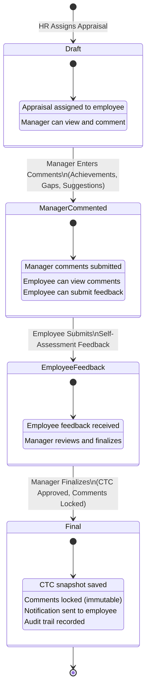

# eAppraisal System - Use Case Diagram

---

## Complete Use Case Diagram

```mermaid
graph TB
    %% =============================================
    %% ACTORS
    %% =============================================
    Admin(("Admin"))
    HR(("HR"))
    Manager(("Manager"))
    Employee(("Employee"))

    %% =============================================
    %% SYSTEM BOUNDARY
    %% =============================================
    subgraph eAppraisal["eAppraisal Employee Recruitment & Appraisal System"]

        %% ------------------------------------------
        %% AUTHENTICATION USE CASES
        %% ------------------------------------------
        subgraph AUTH["Authentication & Access Control"]
            UC_Login["Login to System"]
            UC_Logout["Logout from System"]
            UC_CreateUser["Create User Account"]
            UC_LockUser["Lock User Account"]
            UC_UnlockUser["Unlock User Account"]
            UC_ViewUsers["View All Users"]
        end

        %% ------------------------------------------
        %% EMPLOYEE MANAGEMENT USE CASES
        %% ------------------------------------------
        subgraph EMP_MGMT["Employee Management"]
            UC_CreateEmp["Create Employee"]
            UC_EditEmp["Edit Employee Details"]
            UC_ViewEmpList["View Employee List"]
            UC_CreateEmpLogin["Create Login for Employee"]
            UC_ViewProfile["View Own Profile"]
            UC_EditProfile["Edit Own Profile"]
        end

        %% ------------------------------------------
        %% APPRAISAL CYCLE USE CASES
        %% ------------------------------------------
        subgraph CYCLE_MGMT["Appraisal Cycle Management"]
            UC_CreateCycle["Create Appraisal Cycle"]
            UC_EditCycle["Edit / Close Cycle"]
            UC_ViewCycles["View All Cycles"]
            UC_ViewUnassigned["View Unassigned Employees"]
            UC_AssignAppraisal["Assign Appraisal\nto Employee"]
        end

        %% ------------------------------------------
        %% APPRAISAL WORKFLOW USE CASES
        %% ------------------------------------------
        subgraph WORKFLOW["Appraisal Workflow"]
            UC_ViewMyAppraisals["View My Team's\nAppraisals"]
            UC_EnterComments["Enter Manager Comments\n(Achievements, Gaps, Suggestions)"]
            UC_ViewAppraisalDetail["View Appraisal Detail"]
            UC_SubmitFeedback["Submit Self-Assessment\nFeedback"]
            UC_FinalizeAppraisal["Finalize Appraisal\n(Approve CTC)"]
            UC_ViewOwnAppraisals["View Own Appraisals"]
        end

        %% ------------------------------------------
        %% CTC & COMPENSATION USE CASES
        %% ------------------------------------------
        subgraph CTC["CTC & Compensation"]
            UC_EnterCTC["Enter CTC Breakdown\n(Basic, DA, HRA, Food, PF)"]
            UC_PromotionDecision["Mark Promotion\nDecision"]
            UC_SetNextAppraisal["Set Next Appraisal\nDate"]
        end

        %% ------------------------------------------
        %% REPORTING USE CASES
        %% ------------------------------------------
        subgraph REPORTS["Reporting & Analytics"]
            UC_UpcomingReport["View Upcoming\n(Draft) Appraisals"]
            UC_InProcessReport["View In-Process\nAppraisals"]
            UC_CompletedReport["View Completed\n(Final) Appraisals"]
        end

        %% ------------------------------------------
        %% CROSS-CUTTING USE CASES
        %% ------------------------------------------
        subgraph CROSSCUT["Cross-Cutting Concerns"]
            UC_AuditLog["Record Audit Trail"]
            UC_Notify["Queue Notification"]
            UC_PANMasking["Apply PAN Masking\n(Role-based)"]
            UC_LockComments["Lock Comments\nPost-Finalization"]
        end

    end

    %% =============================================
    %% ACTOR --> USE CASE CONNECTIONS
    %% =============================================

    %% --- ALL USERS ---
    Admin --> UC_Login
    HR --> UC_Login
    Manager --> UC_Login
    Employee --> UC_Login
    Admin --> UC_Logout
    HR --> UC_Logout
    Manager --> UC_Logout
    Employee --> UC_Logout

    %% --- ADMIN ONLY ---
    Admin --> UC_CreateUser
    Admin --> UC_LockUser
    Admin --> UC_UnlockUser
    Admin --> UC_ViewUsers

    %% --- HR ONLY ---
    HR --> UC_CreateEmp
    HR --> UC_EditEmp
    HR --> UC_ViewEmpList
    HR --> UC_CreateEmpLogin
    HR --> UC_CreateCycle
    HR --> UC_EditCycle
    HR --> UC_ViewCycles
    HR --> UC_ViewUnassigned
    HR --> UC_AssignAppraisal

    %% --- MANAGER ONLY ---
    Manager --> UC_ViewMyAppraisals
    Manager --> UC_EnterComments
    Manager --> UC_FinalizeAppraisal
    Manager --> UC_ViewAppraisalDetail

    %% --- EMPLOYEE ONLY ---
    Employee --> UC_ViewProfile
    Employee --> UC_EditProfile
    Employee --> UC_ViewOwnAppraisals
    Employee --> UC_SubmitFeedback
    Employee --> UC_ViewAppraisalDetail

    %% --- REPORTS (Multiple roles) ---
    HR --> UC_UpcomingReport
    HR --> UC_InProcessReport
    HR --> UC_CompletedReport
    Manager --> UC_UpcomingReport
    Manager --> UC_InProcessReport
    Manager --> UC_CompletedReport
    Employee --> UC_CompletedReport

    %% =============================================
    %% INCLUDE / EXTEND RELATIONSHIPS
    %% =============================================

    %% Finalize includes CTC
    UC_FinalizeAppraisal -.->|"includes"| UC_EnterCTC
    UC_FinalizeAppraisal -.->|"includes"| UC_LockComments
    UC_FinalizeAppraisal -.->|"includes"| UC_Notify
    UC_FinalizeAppraisal -.->|"extends"| UC_PromotionDecision
    UC_FinalizeAppraisal -.->|"extends"| UC_SetNextAppraisal

    %% Assign includes notification
    UC_AssignAppraisal -.->|"includes"| UC_Notify

    %% Create Employee extends to login
    UC_CreateEmp -.->|"extends"| UC_CreateEmpLogin

    %% Cross-cutting triggered by actions
    UC_Login -.->|"includes"| UC_AuditLog
    UC_CreateUser -.->|"includes"| UC_AuditLog
    UC_EnterComments -.->|"includes"| UC_AuditLog
    UC_SubmitFeedback -.->|"includes"| UC_AuditLog
    UC_FinalizeAppraisal -.->|"includes"| UC_AuditLog
    UC_LockUser -.->|"includes"| UC_AuditLog
    UC_UnlockUser -.->|"includes"| UC_AuditLog

    %% PAN Masking on employee views
    UC_ViewEmpList -.->|"includes"| UC_PANMasking
    UC_ViewProfile -.->|"includes"| UC_PANMasking

    %% =============================================
    %% STYLING
    %% =============================================
    classDef actorStyle fill:#4A90D9,stroke:#2C5F8A,color:#FFFFFF,stroke-width:3px,font-size:16px
    classDef authStyle fill:#E74C3C,stroke:#C0392B,color:#FFFFFF,stroke-width:1px
    classDef empStyle fill:#27AE60,stroke:#1E8449,color:#FFFFFF,stroke-width:1px
    classDef cycleStyle fill:#8E44AD,stroke:#6C3483,color:#FFFFFF,stroke-width:1px
    classDef workflowStyle fill:#F39C12,stroke:#D68910,color:#000000,stroke-width:1px
    classDef ctcStyle fill:#E67E22,stroke:#CA6F1E,color:#FFFFFF,stroke-width:1px
    classDef reportStyle fill:#3498DB,stroke:#2E86C1,color:#FFFFFF,stroke-width:1px
    classDef crosscutStyle fill:#95A5A6,stroke:#717D7E,color:#000000,stroke-width:1px

    class Admin,HR,Manager,Employee actorStyle
    class UC_Login,UC_Logout,UC_CreateUser,UC_LockUser,UC_UnlockUser,UC_ViewUsers authStyle
    class UC_CreateEmp,UC_EditEmp,UC_ViewEmpList,UC_CreateEmpLogin,UC_ViewProfile,UC_EditProfile empStyle
    class UC_CreateCycle,UC_EditCycle,UC_ViewCycles,UC_ViewUnassigned,UC_AssignAppraisal cycleStyle
    class UC_ViewMyAppraisals,UC_EnterComments,UC_ViewAppraisalDetail,UC_SubmitFeedback,UC_FinalizeAppraisal,UC_ViewOwnAppraisals workflowStyle
    class UC_EnterCTC,UC_PromotionDecision,UC_SetNextAppraisal ctcStyle
    class UC_UpcomingReport,UC_InProcessReport,UC_CompletedReport reportStyle
    class UC_AuditLog,UC_Notify,UC_PANMasking,UC_LockComments crosscutStyle
```

---

## Actor-Use Case Matrix

| Use Case | Admin | HR | Manager | Employee |
|----------|:-----:|:--:|:-------:|:--------:|
| **Authentication** | | | | |
| Login to System | X | X | X | X |
| Logout from System | X | X | X | X |
| Create User Account | X | | | |
| Lock User Account | X | | | |
| Unlock User Account | X | | | |
| View All Users | X | | | |
| **Employee Management** | | | | |
| Create Employee | | X | | |
| Edit Employee Details | | X | | |
| View Employee List | | X | | |
| Create Login for Employee | | X | | |
| View Own Profile | | | | X |
| Edit Own Profile | | | | X |
| **Cycle Management** | | | | |
| Create Appraisal Cycle | | X | | |
| Edit / Close Cycle | | X | | |
| View All Cycles | | X | | |
| View Unassigned Employees | | X | | |
| Assign Appraisal | | X | | |
| **Appraisal Workflow** | | | | |
| View Team Appraisals | | | X | |
| Enter Manager Comments | | | X | |
| View Appraisal Detail | | | X | X |
| Submit Self-Assessment | | | | X |
| Finalize Appraisal (CTC) | | | X | |
| View Own Appraisals | | | | X |
| **Reporting** | | | | |
| Upcoming (Draft) Report | | X | X | |
| In-Process Report | | X | X | |
| Completed (Final) Report | | X | X | X |

---

## Use Case Descriptions

### Authentication & Access Control

| ID | Use Case | Actor(s) | Description | Precondition | Postcondition |
|----|----------|----------|-------------|--------------|---------------|
| UC-01 | Login | All | User enters email + password to authenticate | Valid account exists, not locked | Session created, redirected to role dashboard |
| UC-02 | Logout | All | User ends their session | User is logged in | Session cleared, redirected to login |
| UC-03 | Create User | Admin | Creates a new user account with role assignment | Admin is logged in | New user + linked employee created |
| UC-04 | Lock User | Admin | Manually locks a user account | Admin is logged in, user exists | User cannot login until unlocked |
| UC-05 | Unlock User | Admin | Unlocks a locked account, resets failed attempts | Admin is logged in, user is locked | User can login again |
| UC-06 | View Users | Admin | Views list of all users with lock status | Admin is logged in | User list displayed |

### Employee Management

| ID | Use Case | Actor(s) | Description | Precondition | Postcondition |
|----|----------|----------|-------------|--------------|---------------|
| UC-07 | Create Employee | HR | Creates employee record with all details | HR is logged in | Employee added to system |
| UC-08 | Edit Employee | HR | Updates employee details (dept, manager, etc.) | HR is logged in, employee exists | Employee record updated |
| UC-09 | View Employees | HR | Lists all employees with PAN masking | HR is logged in | Employee list displayed (HR sees full PAN) |
| UC-10 | Create Login | HR | Creates login account during employee creation | HR is logged in, checkbox selected | Employee can now login to system |
| UC-11 | View Profile | Employee | Views own employee profile | Employee is logged in | Profile displayed (PAN masked) |
| UC-12 | Edit Profile | Employee | Updates personal fields (name, phone, address) | Employee is logged in | Profile updated (cannot change dept/manager) |

### Appraisal Cycle Management

| ID | Use Case | Actor(s) | Description | Precondition | Postcondition |
|----|----------|----------|-------------|--------------|---------------|
| UC-13 | Create Cycle | HR | Creates new appraisal cycle with dates | HR is logged in | Cycle created with "Open" state |
| UC-14 | Edit Cycle | HR | Updates cycle name, dates, or state | HR is logged in, cycle exists | Cycle updated (can close cycle) |
| UC-15 | View Cycles | HR | Lists all appraisal cycles | HR is logged in | Cycles displayed with state badges |
| UC-16 | View Unassigned | HR | Shows employees not yet assigned to open cycles | HR is logged in, open cycles exist | Unassigned employee list displayed |
| UC-17 | Assign Appraisal | HR | Assigns an employee to an appraisal cycle | Employee has manager, cycle is open | Appraisal created in "Draft" status |

### Appraisal Workflow

| ID | Use Case | Actor(s) | Description | Precondition | Postcondition |
|----|----------|----------|-------------|--------------|---------------|
| UC-18 | View Team Appraisals | Manager | Lists appraisals of direct reports | Manager is logged in | Appraisals for managed employees shown |
| UC-19 | Enter Comments | Manager | Provides Achievements, Gaps, Suggestions | Appraisal in Draft status | Status changes to "ManagerCommented" |
| UC-20 | View Detail | Manager, Employee | Views full appraisal with all sections | User is logged in, appraisal exists | All details displayed based on status |
| UC-21 | Submit Feedback | Employee | Provides self-assessment and feedback text | Appraisal in "ManagerCommented" status | Status changes to "EmployeeFeedback" |
| UC-22 | Finalize | Manager | Approves CTC, locks comments, marks final | Appraisal not yet finalized | Status = "Final", CTC saved, comments locked |
| UC-23 | View Own Appraisals | Employee | Lists all appraisals assigned to self | Employee is logged in | Own appraisals displayed |

### Reporting

| ID | Use Case | Actor(s) | Description | Precondition | Postcondition |
|----|----------|----------|-------------|--------------|---------------|
| UC-24 | Upcoming Report | HR, Manager | View Draft appraisals | User is logged in | Draft appraisals shown (role-filtered) |
| UC-25 | In-Process Report | HR, Manager | View ManagerCommented + EmployeeFeedback | User is logged in | In-process appraisals shown |
| UC-26 | Completed Report | HR, Manager, Employee | View finalized appraisals | User is logged in | Final appraisals shown (role-filtered) |

---

## Appraisal Workflow State Machine

