# Backup & Site Recovery Diagrams — eAppraisal System

> **Related ADRs:** ADR-0005 (Site Reliability), ADR-0006 (Backup & Recovery Strategy)  
> **Last Updated:** 2026-03-02

---

## 1. Backup Strategy

The eAppraisal system uses a **layered backup approach** for Azure SQL Database:

- **PITR (Point-in-Time Restore):** 28–35 day retention via automated platform backups (weekly full, 12–24 h differentials, 5–10 min log)
- **LTR (Long-Term Retention):** Weekly fulls with policy-based retention (12 monthly, 7 yearly — up to 10 years) for regulatory compliance
- **Daily Logical Export:** Encrypted export to Azure Blob Storage in a separate Resource Group — independent off-platform copy for ransomware/corruption scenarios
- **Geo-redundant backup storage:** GRS/ZRS for durability and regional recoverability
- **Quarterly Restore Drills:** PITR + LTR restores into isolated subscription with documented RTO/RPO evidence

```mermaid
flowchart TD
    subgraph PRIMARY["☁️ Primary Region — West India (Mumbai)"]
        direction TB
        AKS["🖥️ AKS Cluster\nWeb · API · Export · Notify · Audit"]
        SQLP["🗄️ Azure SQL Database\nZone-Redundant Primary\n(3 AZs)"]
        BLOB_EXPORT["📦 Azure Blob Storage\nDaily Logical Exports\n(Separate RG & Access Boundary)"]
        BACKUP_AUTO["🔄 Automated Platform Backups\nFull (weekly) · Differential (12-24h)\nTransaction Log (5-10 min)\nPITR Retention: 28–35 days"]
        LTR["📅 Long-Term Retention (LTR)\nWeekly Fulls\n12 Monthly · 7 Yearly\nUp to 10 Years"]
        MONITOR["📊 Azure Monitor / Alerts\nExport Job Health\nBackup Failure Alerts"]

        AKS -->|"Reads / Writes"| SQLP
        SQLP -->|"Automated by platform"| BACKUP_AUTO
        SQLP -->|"Policy-based retention"| LTR
        SQLP -->|"Daily encrypted export\n(automation job)"| BLOB_EXPORT
        BLOB_EXPORT -->|"Alert on failure"| MONITOR
        BACKUP_AUTO -->|"Monitor / audit"| MONITOR
    end

    subgraph GRS["☁️ Geo-Redundant Backup Storage"]
        BACKUP_GRS["🌐 GRS / ZRS Backup Storage\nReplicated automated backups\nfor regional durability"]
    end

    subgraph RESTORE["🔬 Restore Targets (Isolated Subscription)"]
        PITR_RESTORE["🔁 PITR Restore\nAccidental delete / recent error\nRTO: minutes\nRPO: ~5–10 min"]
        LTR_RESTORE["🔁 LTR Restore\nLatent corruption / ransomware\nRTO: hours\nRPO: up to weekly full"]
        EXPORT_RESTORE["🔁 Blob Export Restore\nIndependent off-platform recovery\nForensic / selective restore"]
        DRILL["📋 Quarterly Restore Drills\nPITR + LTR validated\nRTO/RPO documented"]
    end

    BACKUP_AUTO -->|"GRS/ZRS replication"| BACKUP_GRS
    BACKUP_AUTO -.->|"Restore within 28–35 days"| PITR_RESTORE
    LTR -.->|"Restore up to 10 years"| LTR_RESTORE
    BLOB_EXPORT -.->|"Independent restore"| EXPORT_RESTORE
    PITR_RESTORE --> DRILL
    LTR_RESTORE --> DRILL

    classDef primary fill:#0078D4,color:#fff,stroke:#005a9e
    classDef backup fill:#107C10,color:#fff,stroke:#0a5c0a
    classDef restore fill:#FF8C00,color:#fff,stroke:#cc7000
    classDef monitor fill:#5C2D91,color:#fff,stroke:#3e1f63

    class AKS,SQLP primary
    class BACKUP_AUTO,LTR,BLOB_EXPORT,BACKUP_GRS backup
    class PITR_RESTORE,LTR_RESTORE,EXPORT_RESTORE,DRILL restore
    class MONITOR monitor
```

---

## 2. Site Recovery — High Availability & Disaster Recovery

The eAppraisal system is designed with **tiered site reliability**:

- **Intra-region HA:** Azure SQL zone-redundancy across 3 AZs; AKS multi-AZ node pools; min 3 replicas per service
- **Global ingress:** Azure Front Door (Anycast + WAF) as primary; Azure Traffic Manager + regional Application Gateway as secondary path
- **Regional DR:** Azure SQL Failover Group to secondary region (East India); AKS cluster can be stood up from IaC in the secondary region

```mermaid
flowchart TD
    USERS["👥 Users\nHR · Manager · Employee · IT Admin\n(APAC / EMEA / AMER)"]

    subgraph EDGE["🌐 Global Edge Layer"]
        AFD["🚀 Azure Front Door\nAnycast · Split-TCP · WAF\nTLS Termination · Rate Limiting\n(Primary Global Ingress)"]
        TM["🔀 Azure Traffic Manager\nDNS-based failover\nHealth probe monitoring\n(Secondary Ingress Orchestrator)"]
    end

    subgraph PRIMARY_REGION["☁️ Primary Region — West India (Mumbai)"]
        direction TB
        AGW_P["🔒 Application Gateway\n(WAF v2) — Regional Ingress"]
        AKS_P["🖥️ AKS Cluster — Primary\n3 Availability Zones\nSystem + User Node Pools"]

        subgraph PODS_P["Kubernetes Workloads (min 3 replicas each)"]
            WEB_P["🌐 Web\n(Blazor/Next.js)"]
            API_P["⚙️ API Service\n(ASP.NET Core)"]
            EXPORT_P["📤 Export Service"]
            NOTIFY_P["🔔 Notification Service"]
            AUDIT_P["📋 Audit Forwarder"]
        end

        HPA_P["📈 HPA + Cluster Autoscaler\nPDBs · Topology Spread"]
        SQL_P["🗄️ Azure SQL Database\nZone-Redundant Primary\n(3 AZs — Active Read/Write)"]
        KV_P["🔑 Azure Key Vault\nSecrets · Certs · Encryption Keys"]
        SB_P["📨 Azure Service Bus\nExport Queue · Notification Outbox"]
        BLOB_P["📦 Azure Blob Storage\nExport Files · Daily DB Exports"]
        MONITOR_P["📊 Azure Monitor\nLog Analytics · App Insights\n→ SIEM / Azure Sentinel"]

        AGW_P --> AKS_P
        AKS_P --> PODS_P
        PODS_P --> HPA_P
        WEB_P -->|"HTTPS"| API_P
        API_P -->|"reads/writes"| SQL_P
        API_P -->|"enqueue"| SB_P
        API_P -->|"audit events"| AUDIT_P
        EXPORT_P -->|"dequeue"| SB_P
        EXPORT_P -->|"signed URLs"| BLOB_P
        NOTIFY_P -->|"dequeue"| SB_P
        AUDIT_P -->|"forward"| MONITOR_P
        AKS_P -->|"secrets"| KV_P
    end

    subgraph SECONDARY_REGION["☁️ Secondary Region — East India (Chennai)"]
        direction TB
        AGW_S["🔒 Application Gateway\n(WAF v2) — Regional Ingress\n(Standby / Active on failover)"]
        AKS_S["🖥️ AKS Cluster — Secondary\n(Standby — provisionable via IaC\nor pre-provisioned warm standby)"]
        SQL_S["🗄️ Azure SQL Database\nFailover Group — Secondary\n(Active Geo-Replica · Read-Only Listener)"]
        BLOB_S["📦 Azure Blob Storage\nGRS-Replicated Exports\n& Blob Backups"]
    end

    subgraph FAILOVER["⚡ Failover Group Listeners"]
        RW_LISTENER["✏️ Read-Write Listener\n→ Always points to active primary"]
        RO_LISTENER["📖 Read-Only Listener\n→ Secondary replica (read offload)"]
    end

    USERS -->|"HTTPS"| AFD
    AFD -->|"Primary path\n(Anycast routing)"| AGW_P
    AFD -->|"Fallback\n(on AFD health failure)"| TM
    TM -->|"Regional failover"| AGW_S

    SQL_P -->|"Async geo-replication"| SQL_S
    SQL_P <-->|"RTO/RPO: planned failover"| FAILOVER
    SQL_S <-->|"Auto-failover on regional outage"| FAILOVER
    BLOB_P -->|"GRS replication"| BLOB_S

    API_P -->|"Connect via\nRW Listener"| RW_LISTENER
    EXPORT_P -->|"Connect via\nRO Listener\n(read offload)"| RO_LISTENER

    AGW_S --> AKS_S
    AKS_S -->|"reads/writes\n(after failover)"| SQL_S

    classDef edge fill:#0078D4,color:#fff,stroke:#005a9e
    classDef primary_region fill:#107C10,color:#fff,stroke:#0a5c0a
    classDef secondary_region fill:#FF8C00,color:#fff,stroke:#cc7000
    classDef failover fill:#5C2D91,color:#fff,stroke:#3e1f63
    classDef users fill:#008272,color:#fff,stroke:#005a4e

    class AFD,TM edge
    class AGW_P,AKS_P,SQL_P,KV_P,SB_P,BLOB_P,MONITOR_P,WEB_P,API_P,EXPORT_P,NOTIFY_P,AUDIT_P,HPA_P,PODS_P primary_region
    class AGW_S,AKS_S,SQL_S,BLOB_S secondary_region
    class RW_LISTENER,RO_LISTENER failover
    class USERS users
```

---

## 3. Runbook Quick Reference

| Scenario | Recovery Path | Tooling | Expected RTO |
|---|---|---|---|
| **Accidental row/table delete** | PITR → restore to isolated DB → selective copy | Azure Portal / CLI | Minutes–Hours |
| **Latent data corruption** | LTR restore (monthly/yearly backup) | Azure Portal / CLI | Hours |
| **Ransomware / storage compromise** | Daily Blob export restore (independent copy) | Azure CLI + custom script | Hours |
| **AZ failure (intra-region)** | Automatic — SQL zone-redundancy + AKS multi-AZ | Transparent to app | Near-zero |
| **Primary region outage** | Failover Group auto/manual failover → secondary region | Azure Portal / CLI / automation | Minutes (planned) |
| **AFD global misconfiguration** | Traffic Manager → regional App Gateway path | DNS failover (TM health probes) | < 5 min (probe interval) |
| **Node pool failure / pod crash** | AKS self-healing + HPA scale-out | Kubernetes control plane | Seconds–Minutes |

---

## 4. Recovery Objectives Summary

| Tier | Mechanism | RPO | RTO |
|---|---|---|---|
| Intra-region HA (AZ failure) | Zone-redundant SQL + multi-AZ AKS | ~0 (synchronous) | Near-zero |
| Recent data error (< 35 days) | PITR | 5–10 minutes (log cadence) | Minutes–Hours |
| Long-range corruption (< 10 years) | LTR weekly full | Up to 7 days (weekly backup) | Hours |
| Independent copy / ransomware | Daily Blob export | Up to 24 hours | Hours |
| Regional DR | Failover Group (async geo-replication) | Seconds–minutes (replication lag) | Minutes (planned) / < 1 h (unplanned) |
