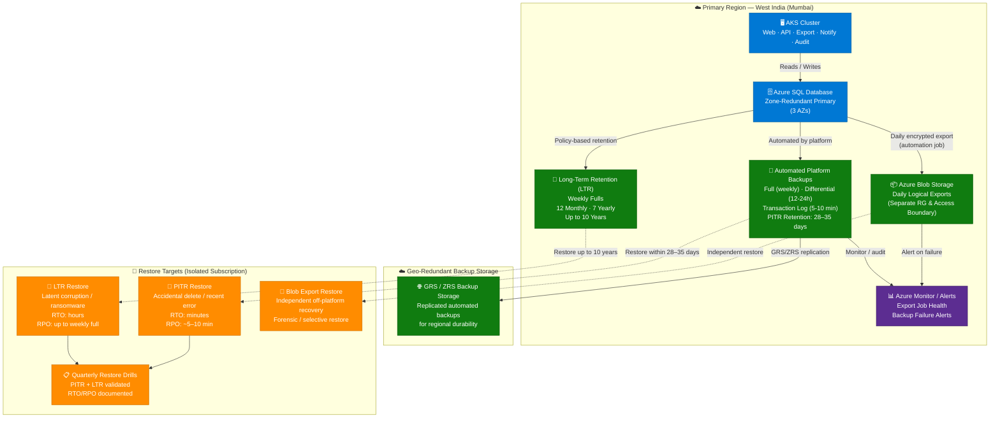

# eAppraisal — Backup Strategy Diagram

> **Source:** ADR-0006 (Backup & Recovery Strategy)  
> **Last Updated:** 2026-03-02

```mermaid
flowchart TD
    subgraph PRIMARY["☁️ Primary Region — West India (Mumbai)"]
        direction TB
        AKS["🖥️ AKS Cluster\nWeb · API · Export · Notify · Audit"]
        SQLP["🗄️ Azure SQL Database\nZone-Redundant Primary\n(3 AZs)"]
        BLOB_EXPORT["📦 Azure Blob Storage\nDaily Logical Exports\n(Separate RG & Access Boundary)"]
        BACKUP_AUTO["🔄 Automated Platform Backups\nFull (weekly) · Differential (12-24h)\nTransaction Log (5-10 min)\nPITR Retention: 28–35 days"]
        LTR["📅 Long-Term Retention (LTR)\nWeekly Fulls\n12 Monthly · 7 Yearly\nUp to 10 Years"]
        MONITOR["📊 Azure Monitor / Alerts\nExport Job Health\nBackup Failure Alerts"]

        AKS -->|"Reads / Writes"| SQLP
        SQLP -->|"Automated by platform"| BACKUP_AUTO
        SQLP -->|"Policy-based retention"| LTR
        SQLP -->|"Daily encrypted export\n(automation job)"| BLOB_EXPORT
        BLOB_EXPORT -->|"Alert on failure"| MONITOR
        BACKUP_AUTO -->|"Monitor / audit"| MONITOR
    end

    subgraph GRS["☁️ Geo-Redundant Backup Storage"]
        BACKUP_GRS["🌐 GRS / ZRS Backup Storage\nReplicated automated backups\nfor regional durability"]
    end

    subgraph RESTORE["🔬 Restore Targets (Isolated Subscription)"]
        PITR_RESTORE["🔁 PITR Restore\nAccidental delete / recent error\nRTO: minutes\nRPO: ~5–10 min"]
        LTR_RESTORE["🔁 LTR Restore\nLatent corruption / ransomware\nRTO: hours\nRPO: up to weekly full"]
        EXPORT_RESTORE["🔁 Blob Export Restore\nIndependent off-platform recovery\nForensic / selective restore"]
        DRILL["📋 Quarterly Restore Drills\nPITR + LTR validated\nRTO/RPO documented"]
    end

    BACKUP_AUTO -->|"GRS/ZRS replication"| BACKUP_GRS
    BACKUP_AUTO -.->|"Restore within 28–35 days"| PITR_RESTORE
    LTR -.->|"Restore up to 10 years"| LTR_RESTORE
    BLOB_EXPORT -.->|"Independent restore"| EXPORT_RESTORE
    PITR_RESTORE --> DRILL
    LTR_RESTORE --> DRILL

    classDef primary fill:#0078D4,color:#fff,stroke:#005a9e
    classDef backup fill:#107C10,color:#fff,stroke:#0a5c0a
    classDef restore fill:#FF8C00,color:#fff,stroke:#cc7000
    classDef monitor fill:#5C2D91,color:#fff,stroke:#3e1f63

    class AKS,SQLP primary
    class BACKUP_AUTO,LTR,BLOB_EXPORT,BACKUP_GRS backup
    class PITR_RESTORE,LTR_RESTORE,EXPORT_RESTORE,DRILL restore
    class MONITOR monitor
```
