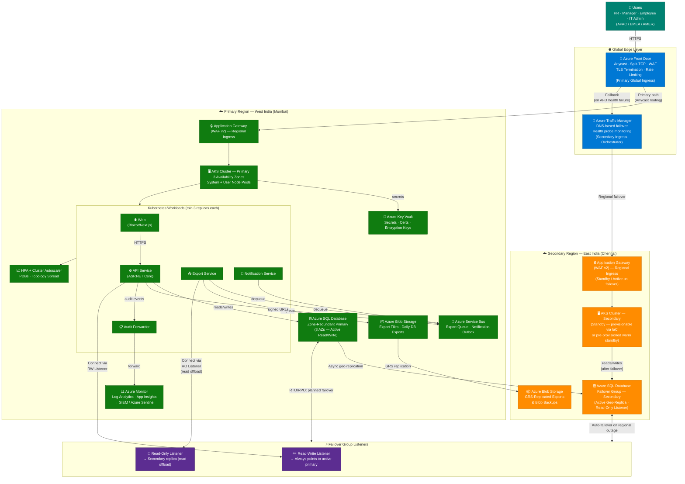

# eAppraisal — Site Recovery & High Availability Diagram

> **Source:** ADR-0005 (Site Reliability Strategy)  
> **Last Updated:** 2026-03-02

```mermaid
flowchart TD
    USERS["👥 Users\nHR · Manager · Employee · IT Admin\n(APAC / EMEA / AMER)"]

    subgraph EDGE["🌐 Global Edge Layer"]
        AFD["🚀 Azure Front Door\nAnycast · Split-TCP · WAF\nTLS Termination · Rate Limiting\n(Primary Global Ingress)"]
        TM["🔀 Azure Traffic Manager\nDNS-based failover\nHealth probe monitoring\n(Secondary Ingress Orchestrator)"]
    end

    subgraph PRIMARY_REGION["☁️ Primary Region — West India (Mumbai)"]
        direction TB
        AGW_P["🔒 Application Gateway\n(WAF v2) — Regional Ingress"]
        AKS_P["🖥️ AKS Cluster — Primary\n3 Availability Zones\nSystem + User Node Pools"]

        subgraph PODS_P["Kubernetes Workloads (min 3 replicas each)"]
            WEB_P["🌐 Web\n(Blazor/Next.js)"]
            API_P["⚙️ API Service\n(ASP.NET Core)"]
            EXPORT_P["📤 Export Service"]
            NOTIFY_P["🔔 Notification Service"]
            AUDIT_P["📋 Audit Forwarder"]
        end

        HPA_P["📈 HPA + Cluster Autoscaler\nPDBs · Topology Spread"]
        SQL_P["🗄️ Azure SQL Database\nZone-Redundant Primary\n(3 AZs — Active Read/Write)"]
        KV_P["🔑 Azure Key Vault\nSecrets · Certs · Encryption Keys"]
        SB_P["📨 Azure Service Bus\nExport Queue · Notification Outbox"]
        BLOB_P["📦 Azure Blob Storage\nExport Files · Daily DB Exports"]
        MONITOR_P["📊 Azure Monitor\nLog Analytics · App Insights\n→ SIEM / Azure Sentinel"]

        AGW_P --> AKS_P
        AKS_P --> PODS_P
        PODS_P --> HPA_P
        WEB_P -->|"HTTPS"| API_P
        API_P -->|"reads/writes"| SQL_P
        API_P -->|"enqueue"| SB_P
        API_P -->|"audit events"| AUDIT_P
        EXPORT_P -->|"dequeue"| SB_P
        EXPORT_P -->|"signed URLs"| BLOB_P
        NOTIFY_P -->|"dequeue"| SB_P
        AUDIT_P -->|"forward"| MONITOR_P
        AKS_P -->|"secrets"| KV_P
    end

    subgraph SECONDARY_REGION["☁️ Secondary Region — East India (Chennai)"]
        direction TB
        AGW_S["🔒 Application Gateway\n(WAF v2) — Regional Ingress\n(Standby / Active on failover)"]
        AKS_S["🖥️ AKS Cluster — Secondary\n(Standby — provisionable via IaC\nor pre-provisioned warm standby)"]
        SQL_S["🗄️ Azure SQL Database\nFailover Group — Secondary\n(Active Geo-Replica · Read-Only Listener)"]
        BLOB_S["📦 Azure Blob Storage\nGRS-Replicated Exports\n& Blob Backups"]
    end

    subgraph FAILOVER["⚡ Failover Group Listeners"]
        RW_LISTENER["✏️ Read-Write Listener\n→ Always points to active primary"]
        RO_LISTENER["📖 Read-Only Listener\n→ Secondary replica (read offload)"]
    end

    USERS -->|"HTTPS"| AFD
    AFD -->|"Primary path\n(Anycast routing)"| AGW_P
    AFD -->|"Fallback\n(on AFD health failure)"| TM
    TM -->|"Regional failover"| AGW_S

    SQL_P -->|"Async geo-replication"| SQL_S
    SQL_P <-->|"RTO/RPO: planned failover"| FAILOVER
    SQL_S <-->|"Auto-failover on regional outage"| FAILOVER
    BLOB_P -->|"GRS replication"| BLOB_S

    API_P -->|"Connect via\nRW Listener"| RW_LISTENER
    EXPORT_P -->|"Connect via\nRO Listener\n(read offload)"| RO_LISTENER

    AGW_S --> AKS_S
    AKS_S -->|"reads/writes\n(after failover)"| SQL_S

    classDef edge fill:#0078D4,color:#fff,stroke:#005a9e
    classDef primary_region fill:#107C10,color:#fff,stroke:#0a5c0a
    classDef secondary_region fill:#FF8C00,color:#fff,stroke:#cc7000
    classDef failover fill:#5C2D91,color:#fff,stroke:#3e1f63
    classDef users fill:#008272,color:#fff,stroke:#005a4e

    class AFD,TM edge
    class AGW_P,AKS_P,SQL_P,KV_P,SB_P,BLOB_P,MONITOR_P,WEB_P,API_P,EXPORT_P,NOTIFY_P,AUDIT_P,HPA_P primary_region
    class AGW_S,AKS_S,SQL_S,BLOB_S secondary_region
    class RW_LISTENER,RO_LISTENER failover
    class USERS users
```
